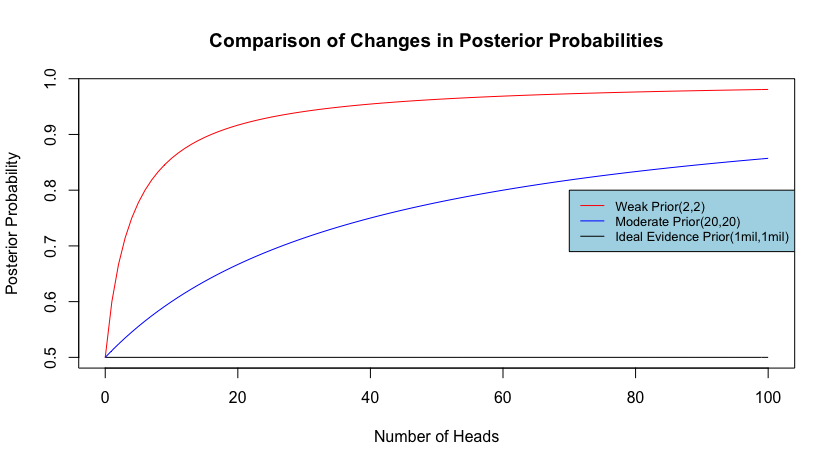
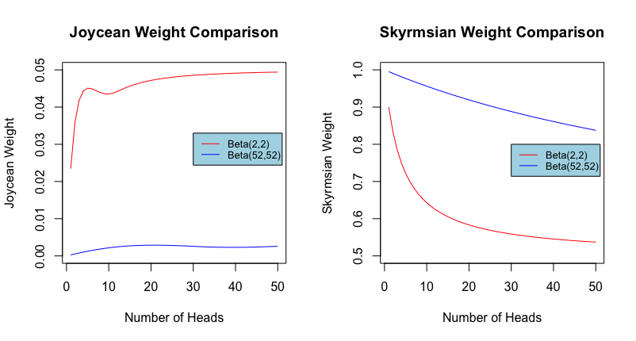
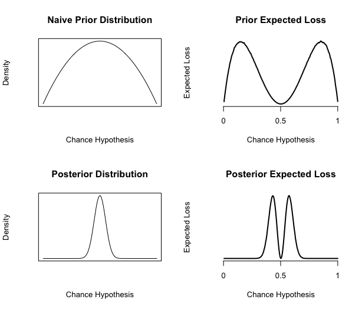
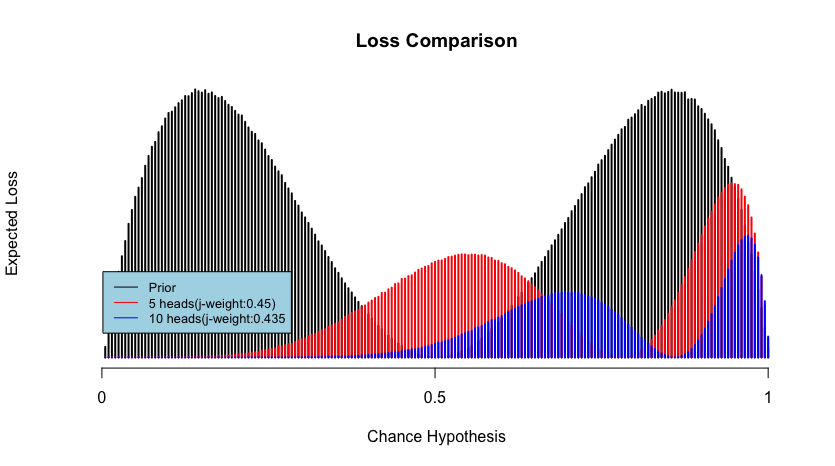

# Introduction
<!--
In this chapter I shall examine accounts of evidential weight by Keynes and others. I will examine four views in total: Keynes' early view of weight as the absolute amount of evidence, Ramsey's weight as the expected value of information, the resiliency account in formal epistemology, and, lastly, Keynes's refined view expressed in his *General Theory of Employment, Interest, and Money*. These views, with the exception of the last one aims to capture our intuition about the weight of evidence by explicating the notion in terms of some formal notions, such as conditional relevance or expected utility. While they can be, and often are, seen as competing accounts for evidential weight, my claim is that there is a conceptual unity in these views, and that they are quantitative measures that capture important aspects of the very notion of evidential weight.

This chapter is divided in four major sections, each devoted to an account of weight. In the first section, I shall focus on Keynes' original proposal that evidential weight is the absolute amount of relevance evidence, and I shall show that Keynes' attempt to tie weight directly to relevance backfires. In section 2, I will try to extrapolate an account of evidential weight from a note by Ramsey, written in response to a puzzle about weight posed by Keynes. In section 3, I focus on the notion of resiliency mentioned by Jeffrey, formalized by Skyrms, and recently refined by Joyce. In the last section, I return to Keynes, by trying to reconstruct a different notion of weight by interpreting Keynes' disagreement with G. E. Moore on the force of expected value, in light of his later ideas about the role of Knightian uncertainty plays in economics.
 -->

<!--
My main purpose is to argue against Keynes' idea that the weight of evidence for a belief is the absolute amount of relevant evidence we have for that belief. Keynes defines _relevance_ in terms of the difference between prior and posterior probabilities - an account still accepted by many Bayesians. Nevertheless, he notices that sometimes intuitively relevant evidence could change the probability of the hypothesis in question through conditionalization. He then proposes a "strict" definition to capture those cases. As we shall see, the second definition has the problematic implication of regarding any proposition $P$ not implied by another proposition $H$ and our background knowledge as being relevant to $H$. After examining and criticizing his notion of evidential weight as the amount of relevant evidence, I turn to an important remark by Keynes that, I shall suggest, opens the door to the core epistemological problem the very idea of evidential weight is supposed to address. I call this the problem of epistemic urgency. -->

<!-- # Weight as Absolute Amount of Evidence -->

While Keynes was not the first person to discuss the weight of evidence, Keynes' exposition of the idea in his _Treatise on Probability_ is perhaps the most referenced source in the topic.^[The first person who noted it was Peirce, whose view shall be the main focus of chapter 3.] While he seems rather ambivalent about the importance of evidential weight, saying that he finds it "somewhat novel" but is "uncertain as to how much importance to attach to it," he has made many important contributions to ways in which evidential weight can be conceptualized.

This chapter examine three conceptions of weight in Keynes' *Treatise*. The first is Keynes' official position that the weight of evidence is the _absolute amount_ of relevance evidence. The second is an expected utility based notion that is extrapolated from an exchange between Keynes and Ramsey about a puzzle on the rationality of evidence gathering noted by Keynes. The third is the notion of *resilience* proposed by Skyrms, which also received a new refined by James Joyce. My contention is that while none of the  sufficiently captures the notion of weight, but, far from being mutually exclusive, they should be seen as complementary explications of evidential weight. While this chapter partly functions as a review on the literature on the weight of evidence, its main contribution is to construct a conceptually and historically unified view of the subject.

# Weight as the Absolute Amount of Evidence
## Keynes' view in _A Treatise in Probability_

Let us begin, however, with a brief overview of the account of probability provided in the _Treatise_. According to Keynes, probability is a logical relation between two propositions. This relation is _logical_ in the literal sense, because Keynes sees it as the same relation as the entailment relation between premises and conclusion in a deductive argument, only differing in degrees. Keynes says:

> Inasmuch as it is always assumed that we can sometimes judge directly that a conclusion follows from a premiss, it is no great extension of this assumption to suppose that we can sometimes recognise that a conclusion partially follows from, or stands in a relation of probability to, a premiss. [@keynes, 57]

Thus, in a derivation in deductive logic, the set of premises fully entails its conclusion. In probabilistic reasoning, the set of premises *partially* entail its conclusion, so in this view a probability is conceived as the degree of a partial entailment.[@keynes, p.30]

Keynes' interpretation has the advantage of providing a direct explanation on why probability is _normative_: we *should* reason in accordance to the axioms of probability for the same reason that we should respect a deductive rule like _modus ponens_: the degrees of a person's partial belief should correspond to the degree to which the premises render the conclusion probable, whereas in a deductive proof, one has to accept the conclusion as necessarily true, were the premises true.^[There is a technical consequence for this. If probability is a relation, it follows that it never makes sense to talk about the probability of an event without in relation to any other proposition, so for Keynes all probabilities are conditional probabilities.Sometimes I will write $P(H)$. In the Keynesian context, it should be interpret as the probability of H conditional on some background knowledge $K$]

Since probability is a logical relation between propositions, it shares with the classical view of probability, i.e., Frequentism, that probability is _objective_. However, on Keynes' view, probability can only be known to us through intuition and perception. Keynes asserts that we find Darwin's theory probable not because it somehow appeals to our subjective sensibility, but that

> there is some real objective relation between Darwin’s evidence and his conclusions, which is independent of the mere fact of our belief, and which is just as real and objective, though of a different degree, as that which would exist if the argument were as demonstrative as a syllogism.[@keynes, p.5]

The epistemology behind the *Treatise* is rooted in the views of Bertrand Russell and G. E. Moore. In particular, Keynes accepts Russell's distinction between knowledge by acquaintance and by description.[@keynes, p.11] Knowledge by acquaintance, a cornerstone of British empiricism, refers to knowledge that can only be acquired through direct perception, such as the qualitative experience of seeing yellow. So, as far as epistemology goes, Keynes in the _Treatise_ is an orthodox empiricist in the British tradition. He, for instance, accepts that thesis of logical atomism that there are basic logical atoms knowable only through the senses:

> In all knowledge, therefore, there is some direct element; and logic can never be made purely mechanical. All it can do is so to arrange the reasoning that the logical relations, which have to be perceived directly, are made explicit and are of a simple kind. [@keynes, p. 14]

However, while these logical relations are basic perceptible elements, Keynes does not think all probability relations are knowable. In this aspect, Keynes disagrees with the followers of Laplace, such as De Morgan, and many modern Bayesians that all probabilities can be given a determinate value.[@keynes, ch. 3 sec. 2-6] Keynes maintains there are some probabilities that can only be vaguely known, some probability can only be measured by comparing to another, and some probabilities are neither measurable nor comparable.

The identification of probability as perceptible relation has introduced an element of subjectivity, and Keynes admits just as much.[@keynes, ch.2 sec. 11] This is further complicated by Keynes' suggestion that some probability relation more precisely perceived than others. How ought we to, for instance, resolve disagreements when two people claim to perceive the same relation differently? Keynes concedes that "some may have a greater power of logical intuition than others".[@keynes, 17] So some people just happen to be able to perceive logical relations more clearly.

It is then almost ironic that Keynes's claim is directly contradicted by Frank Ramsey, a prodigy in both logic and mathematics:

>...there really do not seem to be any such things as the probability relations [Keynes] describes. He supposes that, at any rate in certain cases, they can be perceived; but speaking for myself I feel confident that this is not true. I do not perceive them, and if I am to be persuaded that they exist it must be by argument; moreover I shrewdly suspect that others do not perceive them either, because they are able to come to so very little agreement as to which of them relates any two given propositions. [@ramsey, p.57]

In response, Ramsey sketches out a framework for a subjective interpretation of probability, in his groundbreaking paper "Truth and Probability". We will return to the Keynes-Ramsey connection in the second half of this chapter. It is worth pointing out some major differences between their views. First, Ramsey rejects Keynes' Russellian empiricism and the appeal to intuitable probability relations; instead, Ramsey draws from C.S. Peirce's pragmatism and argues for an operationalized and behavioral account of subjective probability. Second, to explicate the equality relation between probability, Ramsey abandons the use of the principle of indifference altogether. Instead, he proposes a procedure to elicit probability assignments based on the agent's betting behavior. Third, Ramsey rejects Keynes' commitment that not all probabilities are knowable. Instead, he adopts what comes to be the dominant Bayesian position that all probabilities can be given a precise numeric values.

From a Bayesian perspective, no doubt Ramsey emerges as the victor of the debate. This is bolstered by Keynes' obituary of Ramsey, in which he states:

>Ramsey argues, as against the view which I had put forward, that probability is concerned not with objective relations between propositions but (in some sense) with degrees of belief... the basis of our degrees of belief - or the a priori probabilities, as they used to be called-is part of our human outfit, perhaps given us merely by natural selection, analogous to our perceptions and our memories rather than to formal logic. So far I yield to Ramsey - I think he is right.[@keynesbio, p.301]

This often cited quote is usually interpreted as a fact that Keynes has given up wholesale on his view, but this is not quite true. Within context, Keynes makes it quite clear that he was only conceding that the appeal to Russellian epistemology was a mistake, and that Ramsey's Peircean approach was a sounder methodology, but he does not not think the *rationality* of degrees of belief can be justified pragmatically. Furthermore, some interpreters have suggested that Keynes' *Treatise* still provides a viable interpretation of probability, as long as we ignore the first two chapters on epistemology.[@keynesafterramsey] Some philosophers, such as Henry Kyburg, has defended and extended the logical interpretation of probability by combining the insights of both Carnap and Keynes.[@kyburglogical]

## The Principle of Indifference

Even in the *Treatise*, Keynes recognizes the gap left open by the appeal to intuition. One problem for him is to find a principled way with which we can determine if our perception of certain probability relations are really genuine furniture of the logical space. Keynes' general strategy is to first appeal to our intuition about some basic properties of probabilities. He then informally argues for some conditions under which these properties are genuine, and finally these informal conditions and principles are given a formal treatment in the second part of the *Treatise*, in which he develops the fundamental theorems.

Perhaps the most important relation is  _judgments of indifference_ between two propositions. The relation of indifference has its root in Laplace's "Principle of Non-Sufficient Reason":

> When the probability of a simple event is unknown, one may suppose that it is equally likely to take on any value from zero to one... the probability of each of these hypotheses, given the observed event, is a fraction whose numerator is the probability of the event under this hypothesis, and whose denominator is the sum of similar probabilities under each of the hypotheses.[@laplace, 20]

In other words, when we are in complete ignorance regarding the event, the probability of each possible outcome is:

$$\frac{\text{1}}{\text{\# of total possible hypotheses}}$$

Laplace's rule was harshly criticized on many grounds. One is the charge that it leads to absurdity, which tends to arise when the space of possible hypotheses is not clearly delineated. Peirce, for instance, asks us to suppose that there are inhabitants on Saturn but we have no idea what color of hair they have.[@probabilityofinduction, p.296] Since we are in total ignorance about whether or not their hair color is red, the principle says that the probability of their hair being red is $1/2$. This would also goes for the probabilities of their hair being blue, green, yellow, etc. Assuming they can only have one hair color, this means that these are mutually exclusive events, but since they are all $1/2$, the sum of all of these probabilities would be more than 1, which violates the axioms of probability.

When Keynes wrote _A Treatise on Probability_ many years after Laplace, he was keenly aware of these paradoxical results. However, he thinks that the paradoxes only suggest that the principle is to be restricted, not abandoned altogether. He argues that (what he now calls) the Principle of Indifference should not be used when the alternatives under consideration can be further analyzed, or, using his term, "divisible". Once all the alternatives are _indivisible_, each of them should be assigned the probability of $1/n$, where n is the number of alternatives.[@keynes, 60] Only when the conditions for the proper application of the Principle of Indifference is satisfied, our judgment of indifference is _justified_. So in this thought experiment, if one intuits that the probability of the inhabitant having red hair is $1/2$, she is not seeing the logical relation clearly, as demonstrated by the clearly defined Principle of Indifference.

Thus, the use of the principle in Peirce's example is not legitimate, because the probabilities should be equally divided among all possible colors 1/n, where n is number of possible colors, not $1/2$.  In this case of their hair color being red or not, being not-red is decomposed into being blue, being yellow, etc., the application of the rule is illegitimate in Peirce's example. However, the indivisibility requirement rules out the use of the principle of indifference in continuous cases. As Keynes himself recognizes, the indivisibility requirement "is fatal to the practical utility of the Principle of Indifference" when there is no *ultimate* alternatives could be found, which is the case with continuous distributions [@keynes, 68].  

## Keynes on Relevance and Weight

In any case, more pertinent to the notion of evidential weight is the _judgment of irrelevance_ and *relevance*. Keynes' observation is that we often can judge whether one proposition $E$ counts as being relevant to another proposition $H$ by considering whether the probability of $H$ would change on the supposition that $E$ is true. Keynes's example is that, in a typical urn example with some black and white balls, if we want to know the probability of a white ball being randomly chosen, the _color_ of the ball would not change its probability of being chosen, so the idea is that a ball's probability of being chosen conditional on being (say) white is the same as the probability of the ball being chosen in general. [@keynes, 59] So, Keynes proposes that evidence $E$ is irrelevant to the proposition $H$ if and only if:

$$P(H|E ) \neq P(H) $$

Now that the notion of relevance has been introduced, we come to Keynes' idea of the weight of evidence. Keynes is troubled by the fact that the degree of a probability does not scale straightforwardly with the amount of the evidence we have at hand. In a well-known passage, Keynes says:

> As the relevant evidence at our disposal increases, the magnitude of the probability of the argument may either decrease or increase, according as the new knowledge strengthens the unfavourable or the favourable evidence; but something seems to have increased in either case,—we have a more substantial basis upon which to rest our conclusion. I express this by saying that an accession of new evidence increases the weight of an argument. New evidence will sometimes decrease the probability of an argument, but it will always increase its ‘weight.’

The crucial idea here is the weight of evidence is closely tied to the _absolute amount_ of evidence and is conceptual distinct from the "magnitude" of a probability. Keynes explains this as the distinction between the *balance* and the *weight* of evidence: he first brings our attention to the fact that when we consider the conditional probability of the hypothesis in question under all relevant evidence, the resultant number constitutes the _balance_ between favorable and unfavorable evidence.[@keynes, 78] For instance, we may say that when the conditional probability $P(H|E) > 0.5$, then evidence $E$ is somewhat in favor of the hypothesis. Of course, the balance changes as we gather more relevant evidence, and it might go from favorable from unfavorable depending on the nature of the new evidence.

However, as Keynes points out, this is not the only epistemologically significant relation between probability and evidence, for we not only care about how much the current evidence favors the hypothesis, but we also concern ourselves with the _amount_ of evidence involved in calculating the balance of the evidence, and Keynes calls this measure the _weight_ of evidence. But, unlike the balance of the evidence, which can go either direction, the weight of evidence can only go up as we gather more relevant evidence. In Keynes' words, "New evidence will sometimes decrease the probability of an argument, but it will always increase its 'weight.'"[@keynes, 78]

Keynes gives two examples in which the comparison of evidential weight can be determined. The first is that probabilities based on an application of the Principle of Indifference always have the same weights. The second is that two arguments with the same conclusion, but if one is conditional on more relevant evidence, then it is more weighty. For example, say the conclusion is $C$, and we have relevant evidence $A$ and $B$. The weight of the evidence for $P(C|(A\wedge B))$ is greater than $P(C|A)$ as long as 

$$P(C|(A\wedge B)) \neq P(C|A)$$ 

That is, as long as $B$ is relevant evidence to $C$.

A critical assumption Keynes makes in the just mentioned quote is that evidential weight forms a correlative relationship with the amount of _relevant_ evidence: bringing in new evidence _always_ increases the weight of the evidence. As a matter of fact, Keynes suggests that as a matter of definition, to introduce new relevant evidence is simply another way to say that the weight of evidence has increased. [@keynes, 78-9] The implication of this is that since relevance here is defined in terms of the difference between prior and posterior probabilities, the increase in the weight of evidence must be accompanied by a change in probability.

However, this also contradicts directly with Keynes' earlier observation that sometimes can change the weight of the evidence but not its balance. Keynes is aware of this tension, and tries to resolve it by introducing a "strict" definition of relevance.

## The Strict Definition of Relevance

The problem, as Keynes sees it, is that sometimes complex evidence $E$ might be irrelevant to $H$, but its logically simpler components $E_1$ and $E_2$ could be relevant to $H$, so what we have a situation in which some evidence, when gathered altogether, is irrelevant to the hypothesis in question, but, were they gathered separately, they would yield a posterior probability different than the prior, and so they are would individually relevant.

What Keynes has in mind seems to be this: suppose, by a justified judgment of indifference, you have reasons to believe that the urn in front of you contains $50\%$ white balls and $50\%$ black balls, so your probability for $H$, drawing a black ball, would be $0.5$. Further suppose $E_x$ says 'a ball with the color $x$ is randomly drawn and replaced', where $x = w$ for white and $x=b$ for black.

Now further suppose that we have received evidence $E$, where $E = E_b \wedge E_w$. At this point, an argument could be made that your degree of belief for $H$ should stay at $0.5$, since the sample mean is exactly that. In fact, this is a situation in which the use of Laplace's "rule of succession" is justified. ^['...Thus one finds that when an event has happened any number of times running, the probability that it will happen again next time is equal to this number increased by 1, divided by the same number increased by 2.'[@laplace, 11]]. According to this rule, $P(H|E_b \wedge E_w)$ is

$$\frac{1+1}{2+1+1} = \frac{2}{4}=\frac{1}{2}$$

But suppose $E_b$ and $E_w$ are not gathered at the same time: say $E_b$ was received first---this would sensibly nudge your opinion slightly toward the opinion that the proportion of black balls is higher than $50\%$. This could be verified by the rule of succession: $P(H|E_b) = \frac{2}{3} \neq P(H)$, so $E_b$ is relevant to $H$. *Mutatis mutandis*, the same argument could be made for $E_w$. So we have a situation where getting $E_w$ and $E_b$ together does not increase the weight of the evidence, but getting them sequentially would lead to an increase. Though he, too, has to speculate Keynes’ precise meaning, Carnap gives a similar but formal example.[@carnapprob, p.419]

To avoid this type of problems, Keynes proposes a 'strict' definition of irrelevance. While Keynes calls this the 'strict' definition, the purpose of the definition is to relax the requirement for relevance, so that evidence that is irrelevant "as a whole" may still be relevant due to its components. The strict definition states:

> \textbf{Definition of Relevance}: $E$ is relevant to $H$ on background knowledge $K$ if and only if there is at least one proposition $R$, such that

>1.  $R$ is inferable from $(E \wedge K)$.
>2.  $R$ is not inferable from $K$.
>3.  $P(H | R \wedge K )\neq P(H|K)$
>4.  If there is _no_ proposition that satisfies conditions 1-3, then $E$ is irrelevant to $H$.

In other words, the strict definition tries to capture the idea that a piece of evidence $E$ is relevant $H$ if and only if $R$, in conjunction with your existing body of knowledge, can imply some proposition $R$ that is conditionally relevant to $H$. So in the case where $E = E_b \wedge E_w$, $E$ is *not* irrelevant, i.e., relevant, to $H$, because $E_b$, which is inferable from $E \wedge K$, does raise the probability $H$. So, with this new definition, Keynes tries to maintain the close connection between the weight of evidence and the absolute amount of evidence.

Unfortunately, this definition does too little and too much at the same time. It does too little, because not all weighty but irrelevant evidence can be easily decomposed in the way Keynes describes. This is the point of Popper's "paradox of ideal evidence." We shall discuss this in more detail in a later chapter, but the basic idea is that sometimes the evidence we receive is in the form of a basic statistical summary, such as "in a million tosses of the coin $c$, heads occurs in $500,000 \pm 20$ cases."[@popperlogic, 425] So, assuming our prior for the probability of $c$ landing on heads is $1/2$, being conditional on the basic statistical summary should not change this probability---both the prior and posterior probabilities should be $1/2$.

There is something suspicious about this argument, but there does seem to be some difficulty in analyzing the statistical summary in the way Keynes recommends. It might work if the statistical report is a chain of conjunctions, that is, $E_1 \wedge ... E_i ... \wedge E_{1m}$ where the subscript be the index of the trial. _If_ we were to interpret it this way, we might be able to infer $E_1$, which, for example, says that the coin lands on heads on the first toss, and conditional on $E_1$ we get a different posterior probability. But this is not what this report is saying, for we do not know exactly in which of the tosses the coin lands on heads and which tosses tails. In fact, modeled as a Bernoulli trial, the idea is that this particular order does not matter in drawing inferences. Further, it is clear we need more than a chain of conjunctions, because we are given an interval. It is possible that with some clever maneuver we could interpret the statistical report as a chain of disjunctions of conjunctions, but at this point, we must ask ourselves if we are analyzing the evidence or if we are simply distorting it.

There has been attempts to modify Keynes' definition of relevance slightly to accommodate Popper's paradox.[@odonnell, p.50-51] Roughly speaking, the proposal draws from Keynes' stipulation that if $X$ to $Y$ is relevant, then $\neg X$ is also relevant, and the solution would require adding another condition for relevance that requires both conditional probabilities of $P(Y|X)$ and $P(Y|\neg X)$ to be different than $P(Y)$.

As it turns out, however, this point is inconsequential, because Carnap has proven that these additional conditions that supposedly saves Keynes' account of relevance from Popper's paradox renders the relevance relation trivial. Hence I said Keynes' definition also does too much: Keynes' strict definition has the consequence of regarding almost any proposition as being relevant to another, as long as one is not a logical entailment of the another.

## The Problematic Implication of the Strict Definition

Carnap's argument is that Keynes's strict definition has essentially counted anything not implied by background knowledge as being relevant, because any proposition that is not implied by our background knowledge plus hypothesis will always have implied components that are relevant to $H$, however weakly.[@carnapprob, p.420] The argument is roughly that, for any $H$ on background knowledge $K$, if $J$ is not implied by $(H \wedge K)$ and $R$ is some arbitrary evidence relevant to $H$, $J$ can always be shown to be relevant by drawing trivial inferences that that involves $R$, such as $(J \vee \neg R)$.

For a formal argument, first consider these two assumptions about relevance.

> R1. If $E$ is relevant, then $\neg E$ is also relevant.

> R2. If a hypothesis is not implied by our background knowledge, then there is some proposition such that it is relevant to the hypothesis.

I will not argue for these assumptions, but note that they are explicitly accepted by Keynes, so we do not have to find them plausible; we just have to accept them for the sake of this particular argument. In addition, Carnap has also proven that Keynes' definition of irrelevance is equivalent to the following:

> \textbf{Carnap's Definition of Irrelevance}: $E$ is irrelevant to $H$ on $K$ if and only if

>1.  $P(H|K) = P(H|K\wedge E)$ _or_,
>2.  $E\wedge K$ is a contradiction.

This alternative definition will be useful in the proof. Carnap's proof is roughly as follows.^[@carnapprob p.420. My presentation also partly follows @garden] Suppose both evidence $J$ and hypothesis $H$ are contingent on, i.e., not inferable from,  background knowledge $K$. Also suppose a different piece of evidence $R$ that is relevant to $H$ on $K$ - $R$ must exist because of assumption R2 above. For an argument by cases, let $E$ be $(R \wedge \neg J)$. $E$ is either relevant or irrelevant to $H$, and from this we can make an argument by cases. It will be demonstrated that from these assumptions alone, we already know $J$ is relevant, whether or not $E$ is relevant.

Suppose $E$ is relevant: this means that $E$ is relevant to $H$ by virtue of Keynes' stricter definition; because, $E$ contains $R$, which is relevant to $H$ on $K$. By assumption R1, since $E$ is relevant to $H$, $\neg E$ is also relevant to $H$. But this means $J$ is relevant to $H$ as well: $\neg E$ is equivalent to $(\neg R \vee J)$, which is inferable from $J$. Since an implication of $J$ is relevant to $H$ given $K$, this means $J$ must be relevant to $H$.

Now suppose $E$ is irrelevant. Since $R$ is relevant to $H$ on $K$, the only way for $E$ to be irrelevant is for $(\neg J \wedge K \wedge R)$ to be a contradiction (by Carnap's alternative definition), so $\neg(\neg J \wedge K \wedge R)$ has to be true. That is logically equivalent to $(\neg J \wedge K) \to \neg R$. Now, by assumption R1, $\neg R$ is relevant, because $R$ is relevant. The above formula means that from $\neg J$ plus $K$, we can infer $\neg R$, so this means $\neg J$ is relevant, which entails $J$ is relevant.

So, we see that both each case implies that $J$ is relevant. By argument by cases, then, $J$ is relevant. Thus, if $J$ is not inferable from $K$, then $J$ is relevant to $H$.

In addition, if $J$ is relevant to $H$ on $K$, then $J$ is not inferable from $K$, since one of the conditions of the strict definition of relevance is that relevant evidence cannot be a proposition that is a logical consequence of our background knowledge. So, this means that $J$ is relevant to $H$ on $K$ if and only if $J$ is not inferable from $K$.

Loosely speaking, this means that for two propositions, they can be shown to be relevant to each other as long as they do not imply, or contradict each other. Carnap's result shows that Keynes' strict definition is not useful: Carnap thinks that we should simply stick with the simpler definition of relevance. Modern Bayesian have followed Carnap in accepting Keynes' basic definition of relevance as a minimal requirement for any confirmation measure. 

The conclusion to be drawn, I think, is that evidential weight clearly has something to do with how much evidence we have, but it is not worth the trouble to *define* the weight of evidence as the absolute amount of evidence. 

The supposed link between relevance and weight is especially difficulty if probability is to be conceived as a *logical* relation. A deductive analogue of evidential weight would be the number of premises needed to derive the conclusion. In deductive logic, there are different ways in which the same conclusion could be derived; however, in a deductive proof, it makes absolutely no difference between a 2 line proof and 10 line proof. In other words Logic is *weight agnostic*. From a *logical* point of view, we do not care how many premises are involved as long as the argument is valid. Insofar as the number of premises is significant, it is for extralogical reasons. A shorter proof might be desirable because of its elegance, and a longer proof might be less desirable because it's more prone to have false premises. These are, however, not logical consideration, but more general epistemological ones. Thus, it makes no sense to draw a conceptual connection between evidential weight, a non-logical notion, and relevance, a notion that tracks degree of logical entailment.

Further, That the notion of evidential weight goes beyond just the absolute amount of evidence is something Keynes himself recognizes. Keynes sometimes refers the weight of evidence a balance "between the absolute amounts of relevant knowledge and of relevant ignorance respectively"[@keynes, p. 78] In a later chapter of the *Treatise*, he also calls weight "the degree of completeness of the information"[@keynes, p.357] These remarks suggest that weight is about how we *do not* know as much as how much we *do* know. The relationship between ignorance and weight will be examined in the next section.

# Weight as Potential Net Gain in Expected Utility

In the last section, I concerned myself with Keynes' official slogan that evidential weight is the absolute amount of evidence. We saw that Keynes explicitly grounds the concept of evidential weight in his formal notion of relevance. However, in his thinking about the practical significance of evidential weight, he has a slightly notion in mind. In particular, he makes the connection between evidential weight and the *worth* or *value* of the evidence. This points to a *relative* measure of weight, which takes into account between how much information we currently have, and how much information there are to be gathered. In the this section, we will see that Keynes raises some puzzle about the rationality of evidence gathering, which sheds light on this different notion of weight. We will also examine a proposal given by Frank Ramsey.

## Keynes' puzzle about the demand for new evidence

Keynes is not satisfied with his account of evidential weight in the *Treatise*. One particular vexing issue is that he could not seem to explain the *practical* import that the weight of evidence has. He is explicitly conflicted:

> For in deciding on a course of action, it seems plausible to suppose that we ought to take account of the weight as well as the probability of different expectations. But... I do not feel sure that the theory of ‘evidential weight’ has much practical significance.

His diffidence is further amplified by a "a very confusing problem": Bernoulli, he points out, suggests that inductive inference requires the utilization of all evidence available to us. Keynes reasons that this implies that it's always rational to get more evidence, but then it raises another critical question about whether or not one could ever be rational in refusing new evidence. [@keynes, p.84-85] If the answer for the former question is positive, and the latter question negative, then we have to conclude that rationality dictates us that we should never stop looking for more evidence.

Keynes does not make the jump from "using all the evidence" to "get all the evidence" clear. Nevertheless, this problem is revisited many years later in an exchange between Ayer and Carnap. In his *Logical Foundation of Probability*, Carnap restates Bernoulli's claim as "the requirement of total evidence".

> _Requirement of total evidence_: in the application of inductive logic to a given knowledge situation, the total evidence available must be taken as basis for determining the degree of confirmation.[@carnapprob, p.211]

Aver, in response to Carnap, raises the Keynesian question: should "total evidence" include relevant evidence that I do not yet have in possession?[@ayerpae, p.56] The answer must be "yes", Ayer argues. If finding the truth value of some proposition $P$ could potentially sway the balance of my evidence, then I should definitely acquire it. Thus the principle of total evidence seems to suggest that I am also rationally compelled to consider some evidence I do not yet have.

But Ayer points out that this cannot be the whole picture: taken as a rule of rationality, this means we should never stop acquiring unless we are certain that we have acquired all available evidence. This, however, assumes that we know what evidence is available, but it could often be unrealistic to expect to know how much evidence we *do not* currently have.

There is also a deeper problem. The logical interpretation of probability, held by both Carnap and Keynes, takes probability as a logical relation between propositions, so within this picture, inductive rationality is a matter of having the right degrees of belief between premises and conclusion. However, this says nothing about sufficiency of the set of premises I have available as my evidence. In other words, the requirement of the probability axioms does not imply the requirement of total evidence. This is reminiscent of the criticism of coherentism in epistemology. If having knowledge is having a belief justified in virtue of being coherent with the rest of my beliefs, how do I know if my beliefs are in any way reflections of the world? This problem affects the subjective interpretation of probability as well. As Leonard Savage points out:

> According to the personalistic view, the role of the mathematical theory of probability is to enable the person using it to detect inconsistencies in his own real or envisaged behavior. It is also understood that, having detected an inconsistency, he will remove it. An inconsistency is typically removable in many different ways, among which the theory gives no guidance for choosing.[@savage, p.57]

Keynes tries to deal with this problem by introducing the dimension of utility to the notion of weight: he suggests that sometimes getting more evidence is clear the action that will "probably produce the greatest amount of good," especially when our evidence is slight and we know more is available. [@keynes, 84-5] Thus, for a given hypothesis of interest $H$, the same evidence $E$ generates different amount of "good" relative to the amount of information we already have for $H$. If an agent has almost no information about $H$, gathering more information would generate the most utility, but for the same evidence, the demand might to low, because the agent might already have enough information about $H$, so getting more evidence would yield very little to no utility. What seems to be the lesson here is that the weight of evidence should be a measure of the *sufficiency* of the evidence, by informing us if the evidence we have at hand is *enough*.

Note, however, that this question can take two forms: the first is a question about finding a threshold of sufficiency: we increase the weight of our evidence until it reaches this threshold, and the second is to *define* sufficiency *in terms* of weight: our body of evidence is sufficient, when relevant evidence no longer increases its weight. The conceptual connection between the sufficiency and weight is tighter in the second form than the first, and this is the route Ramsey takes in his attempt to answer Keynes' question.

## Ramsey on the Value of Evidence

Keynes' implicit suggestion that weight can be a measure of the worth of evidence is picked up by Ramsey, perhaps one of the most famous critics of Keynes' theory of probability. Interestingly, however, he has proven essentially the opposite conclusion reached by Ayer and Keynes: Ramsey shows that we should always look more more evidence, because we can never be worse off from doing it. How can this be?

Ramsey's argument is roughly that, _if_ we assume an agent to be a perfect Bayesian and that new information does not cost anything, then she will never be no worse off getting new evidence.[@ramseyvalue, also see @goodtotalevidence and @savage, sec 6.2] In fact, she is guaranteed to be *better* off as long as the new evidence will tell her something new. A perfect Bayesian agent is someone who studiously updates her opinions based on Bayes' rule and then act by choosing the action that maximize her expected utility. As Skyrms points out, this also implies that the agent knows that she will always *stays* being perfectly Bayesian in the future.

The basic idea of the proof is that the ideal Bayesian will always get better expected utility from more evidence, until there is no more evidence, but even in that case the agent will not be worse off. An intuitive example is perhaps more helpful than reproducing the proof.^[This example is adapted from @leviweight] Suppose we have three hypotheses about the content of an urn in front of us:

1.  $H_b$: 90 black balls and 10 white balls
2.  $H_w$: 10 white balls and 90 black balls
3.  $H_n$: 50 white balls and 50 black balls.

We then start by assuming $P(H_b) = P(H_w) = P(H_n) = 1/3$. Suppose we win \$1 by picking the correct hypothesis. Our expected payoff for choosing each hypothesis would be the same at $1/3$. Nevertheless, we are allow to sample with replacement as many times as we wish. Should we get more evidence? Yes, according to Ramsey, we should.

To begin, at this point, the probability of getting a black ball is the same as getting a white ball. Let $E_b$ be "a black ball is drawn" and $E_w$ for white balls. So:
$$P(E_b) = P(H_b)P(E_b|H_b) + P(H_w)P(E_b|H_w) + P(H_n)P(E_b|H_n)$$
$$=1/3(0.9)+1/3(0.1)+1/3(0.5)=0.5$$
And $P(E_w) = 1 - P(E_b) = 0.5$. So, in the event of drawing a black ball from the urn, we would update our belief like so:

$$P(H_b|E_b) = \frac{P(H_b)P(E_b|H_b)}{P(E_b)}=\frac{1/3(0.9)}{0.5} = 0.6 $$

Similarly, applying the calculation on the other hypotheses, we get:
$$P(H_w|E_b) = 0.067$$
$$P(H_n|E_b) = 0.333$$
Similar argument can be made assuming $E_w$, that is, a white ball is chosen. In that case $P(H_w|E_w) = 0.6$. If we were an ideal Bayesian agent, we should pick $H_b$ if $E_b$, and pick $H_w$ if $E_w$. Since an ideal Bayesian would choose the option that maximizes our expected utility, in either case the expected value after drawing from the urn once is $0.6$, which is an improvement, since before drawing our expected utility is $1/3$ for all options. The net gain in expected utility would be $0.6 - 0.33 = 0.27$, is referred to as *the value of information* in the decision theory literature.[@appliedstatdec p.89-90. For a more digestible presentation see @winkler sec.6.3]

It turns out that we would be even better off if we were to draw from the urn again. Suppose the first draw yields a black ball. So now we have one piece of evidence in hand. Let us refer to our state of belief after the first draw as $H_b', E_b',..$ and so on. For instance, $P(H_b') = P(H_b|E_b)$ and $P(E_b') = P(E_b'|E_b)$. One notable change is that $P(E_b') = 0.7132$ and $P(E_w')=0.2868$. If we draw again and get a black ball, this means:

$$P(H_b'|E_b') = 0.757$$
$$P(H_w'|E_b') = 0.009$$
$$P(H_n'|E_b') = 0.233$$

If a white ball were to be drawn:

$$P(H_b'|E_w') = 0.21$$
$$P(H_w'|E_w') = 0.21$$
$$P(H_n'|E_w') = 0.58$$

Thus, if for the second sample we get a black ball, we would choose $b$ since it has the maximum expected utility at $0.757$, and if we get a white ball, we choose $n$ with the expected value at $0.58$. So, the expected utility, if we were to draw from the urn again, is: $0.7132(0.757) + 0.2867(0.58) = 0.706$, which is an improvement over just drawing once. The net gain is $0.706 - 0.6 = 0.106$. Ramsey's proof shows that we can keep on getting more evidence and we will never be worse off. In fact, we will be better off as long as there is evidence out there we do not yet have.

## Defining Weight in Terms of the Difference in Prior and Posterior Expected Utility

What should we make of Ramsey's proof? There are two issues involved here. The first is whether Ramsey's proof provides an account of evidential weight, and the other is whether it addresses Keynes' puzzle about gathering evidence. The two are related; let us address them in turn.

### Ramseyian Weight

Ramsey's note is tantalizing, because he never clearly explains what he thinks the weight of evidence is, even though it's in the title. But assuming that he is interpreting Keynes' question of the weight of evidence as whether in relation to the value or worth of evidence, it is not far fetched to think that he is thinking evidential weight in terms for the expected utility that new evidence will generate.  Ramsey might have something like the following in mind: the weight of new evidence $E$ for hypothesis $H$ is the difference between the prior expected utility $EU(H)$ and the posterior $EU(H|E)$. Let's call this Ramseyian weight.

For instance, we saw that in the example above, the posterior expected utility of the first draw was $0.27$ higher than our prior expected utility, and we saw a net gain of $0.106$ in expected utility if we were to draw again after drawing a black ball, so we see that the first piece of evidence has a higher Ramseyian weight than the second one. What Ramsey's proof demonstrates is that new evidence has a diminishing return---I get a "bigger bang for the buck" for my evidence gathering endeavor when I have less evidence. In light of this, Keynes' example of the balance of the evidence unchanged by the introduction of new evidence is then somewhat incomplete. What we really have to consider are three different outcomes after the introduction of relevant evidence:

1. Both balance and weight are changed by new evidence.
2. Balance remains the same, but the weight is changed by new evidence.
3. Neither balance nor weight is changed by new evidence.

Outcome 3 is not possible under the Keynesian notion examined in the first section, since according to that definition the introduction of evidence *always* increases its weight, but Ramsey's expected utility approach can account this, since the expected utility that new evidence brings us will approach zero as we exhaust all available evidence. This way of thinking about evidential weight explains how weight cannot be measured just in terms of the amount of relevant evidence at hand: if we are almost always better off getting more evidence, we should incorporate and acquire as much new evidence as possible, but since evidence has a diminishing return, at a certain that new evidence will no longer raise our expected utility in a meaningful way (even though it will also never decrease it). This means that at that point the new evidence will no longer have any Ramseyian weight, since the posterior expected utility will stay the same, even though it would have been weighty if we have no prior evidence. 

### Relevance to Keynes Puzzle

I think that Ramseyan weight captures aspect of the weight of evidence, but it cannot be the whole picture. To be sure, I do not question that given some assumptions, Ramsey's result will necessarily follow: the same result is proven by both Good and Leonard Savage, so there is no doubt that the result will holds if the assumptions are granted, but that's a big _if_.

Perhaps the most crucial assumption here is that new information has no cost. It is assumed in the example that it costs us neither money nor time to draw from the urn. Suppose it costs us 25 cents for each sample. This means that we would be gaining only $0.27-0.25 = 0.02$ in expected payoff for the first draw, and the second draw would definitely not be worth the additional 25 cents. Or suppose that one dollar is not worthy any endeavor that lasts longer than 15 seconds, and it takes 30 seconds to draw from the urn. Cost might also enter into consideration in different forms, e.g., computational cost or memory. As such as minimally realistic assumptions are introduced, Ramsey's result no longer holds.

Savage ponders over an interesting case that introduces yet another dimension of the problem: consider a very ill person, who is given the option to find out with no cost if the disease she has is mortal. Savage points out that an argument can be made that in this case refusing information could be rational. The thought is that the patient may decide that, based on an assessment of her own personality, she would live the rest of her remaining life in agony if she were to find out that her disease is very serious, whereas she could live relatively happily without knowing. Savage's response is that in this case the information is not really free; it has a *psychological* cost.[@savage, p.107] 

Of course, Ramsey probably understood that information was rarely free. It is clear that he intended his note to be an response to Keynes' remarks on weight of evidence, as the title of his note is "Weight or the Value of Knowledge," which suggests that he interprets the problem Keynes poses as a question why evidence is valuable. Good interprets Ayer's remarks in the same way. According to Good, Ayer is questioning "why... we should bother to make new observations." [@goodthinking, p.178] So, both Ramsey and Good seem to think what is needed is a justification for getting new evidence _in general_. With respect to this version of the problem, the proof makes perfect sense, since it demonstrates that all things being equal we usually end up with better expected utility by considering more evidence. But Keynes' question was about reconciling the general duty to get more evidence and the intuition that evidence gathering for a belief of interest is not always a worthy endeavor.

Good, who proved the same result independently of Ramsey, tries to address this issue by distinguishing what he calls Type I and Type II rationality.^[@goodthinking p. 29-30 As far as I could tell, this has nothing to do with the distinction between Type I and Type II error in Frequentist statistics.] Type I rationality is that of the ideal Bayesian agent, one who lives her life by abiding to the principle of maximizing expected utility. Good recognizes, however, that type I rationality provides no guidance in regard to when an investigation should be concluded. This is where type II rationality comes in: it is principle of maximizing expected utility _plus_ the consideration of "the cost of theorizing." More important, the goal of type II is "a sufficient maturity of judgments."[@goodthinking, p.29]

Good's distinction suggests that there are aspects of evidential practice that cannot be captured by the inductive ideal expressed by Type I rationality. In other words, "a sufficient maturity of judgments" cannot just be a matter of maximizing our expected utility. Intuitively, maturity implies a sort of *stability*---a sort of imperturbability against confounding experience. We can interpret Keynes' puzzle in this light: perhaps sometimes it is rational to refuse evidence, because my belief has reached a degree of maturity such that the same evidence that would have been highly relevant at beginning is now uninformative.

<!-- 
This, I think, is one of the normative roles played the weight of evidence: it ought to provide a way to justify the stability of certain judgments. It should guide us in distinguishing between a mature state of belief and just plain stubbornness. The latter is often irrational, and an agent who is simply refusing evidence out of stubbornness should be considered as irrational. -->

# Chance, Resilience, and the Probability of Probability

<!-- This will be elaborated in this section by appealing to the notion *resiliency* in formal epistemology, which has been proposed by Skyrms and Joyce as a explication of evidential weight.
 -->
In the previous sections, we saw that the amount and utility of evidence are part of how we think of the weight of evidence, and stability is one way in which the dynamic between the two is summarized. This complements Keynes' idea that when the evidence is weighty, additional data appears to be less desirable, in that it should also be noted that the high weight is not necessarily *only* a function of the amount of relevance we have; because, sometimes the low desirability of more evidence could be caused by the low expected utility, instead of the lack of evidence.

The idea that evidential weight is a sort of stability allows us to see it not merely as a measurement, but a *disposition*: what *would* happen to my belief, if I were to get new evidence that supports or undermine my current belief? This is implicit in talking about weight as a stability, for stability *is* a disposition.

<!--
The basic idea here is that evidential weight cannot be Skyrm's idea of conditional resiliency, because what is being stabilized here is not -->

<!--
Indeed, while resiliency seems to be a workable as an intuitive answer for Popper's paradox, many important questions still need to be answered: what exactly is being stabilized? Stabilized by what? More important, how does the resilience of a belief affect one's decision? Recall that Keynes' difficulty with evidential weight is that it seems like it could override the mandate of the expected value. It is not at all clear how resiliency is supposed help with that: when push comes to shove, all three priors have the same expected value, and therefore would recommend the same course of action.

Fleshing out the mechanical details of the paradox of ideal evidence will help answering these questions. This will also introduce the Lewisian chance/credence distinction, which will be useful when we discuss Joyce's suggestion. -->

<!-- In the last section, we began with the suggestion that evidential weight should inform how urgent -->

<!-- In the last section, I examined the proposal that the weight of some evidence $E$ could be understood in terms of the expected utility gained by acquiring $E$. We saw that, while such a notion has some attractive properties, it was unable to provide an answer for the problem Keynes poses: in light of the requirement of total evidence, how could one justified in refusing evidence?  Good's idea of a rationality that aims for "a sufficient maturity of judgment" seems to be the right direction, but he has not spelled out exactly what that entails.

In any case, formal epistemologists have proposed a notion of *resilience* that might fit that bill.  -->

This notion of resiliency begins with Popper's so-called "paradox of ideal evidence." As we have seen earlier, the paradox of ideal evidence is supposed to show that evidential weight cannot be captured in terms of Keynesian relevance. We have already seen that Keynes' attempt to expand his definition of relevance to accommodate evidential weight has failed, since it has the unintended consequence of regarding any proposition not implied by the hypothesis, in conjunction with our background knowledge, as being relevant. 

Nevertheless, Popper's paradox has prompted some formal epistemologists to purpose a different way to capture evidential weight, that is, in terms of the _stability_. I shall first give Popper's paradox of ideal evidence a detailed exposition. I then set the stage 

## The Paradox of Ideal Evidence

Popper asks us to consider a certain coin with an unknown bias: let $N$ be the proposition "the next toss of the penny will yield heads".[@popperlogic, 425]  Now, what should $P(N)$ be? He suggests, either by appealing to intuition or the Principle of Indifference, Bayesians would suggest that $P(N) = 0.5$.^[It should be noted that Popper is not attacking the principle of indifference in this context. That is, for this argument he is willing to grant that Bayesians have some way of arriving at $P(N)$---it could be by indifference, through elicitation, etc.]

Now let $I$ be what he calls _the ideal statistical evidence_ in favor of the idea that the coin in question is a fair one. Popper's example is to let $I$ be a statistical report that says 'in a million tosses, the coin landed on heads roughly half a million times.' The exact number is not important, as long as the number of heads and tails would make it practically certain that the coin is fair---the same point could be made using 10 millions instead of a million. Now, given we have ideal evidence $I$, what is the probability of $N$? Popper claims that it would have to be $1/2$. So

$$P (N|I) = P(N) = \frac{1}{2}$$

\noindent However, as discussed earlier, evidence $I$ is relevant to the hypothesis $N$ if and only if

$$ P(N|I) \neq P(N) $$

\noindent If $P(N|I) = P(N) = 1/2$, this means that the ideal evidence is also irrelevant evidence. Popper then concludes:

<!--  -->

> Now this is a little startling; for it means, more explicitly, that our so-called ‘degree of rational belief’ in the hypothesis, [$N$], ought to be completely unaffected by the accumulated evidential knowledge, [$I$]; that the absence of any statistical evidence concerning [the hypothesis that the coin is fair] justifies precisely the same ‘degree of rational belief’ as the weighty evidence of millions of observations which, prima facie, support or confirm or strengthen our belief. [@popperlogic, 426]

What is 'startling' about this? Popper's point appears to be that we *expect* the awareness of evidence $I$ should change our attitude toward $N$ *in some way*, but if our prior for $N$ is already $1/2$, $I$ will not change it in anyway, so on Keynes' account, $I$ is irrelevant. This seems to contradict with our intuition that the ideal evidence should be relevant.

To begin, we should ask: is $I$ ideally favorable to $N$?  The problem is to find a way to make sense out of this "ideally favorable" relation without begging the question against the Bayesians, for Keynes's notions of the relevance and Bayesian's confirmatory favorability are both conceptual tied to the change in posterior probability. Generally speaking, for epistemic Bayesians, $X$ confirms $Y$ if and only if $X$ conditional on $Y$ has a higher probability than just the probability of $X$ alone, so by definition if $X$ confirms $Y$, then $X$ is relevant to $Y$. So, as the argument stands, there is nothing stopping the Bayesian from biting the bullet and insisting that $I$ is irrelevant to $N$, or that $I$ was never ideally favorable to begin with. For his argument to be convincing, Popper needs to motivate an external notion of favorability to establish premise 1, from which we can (supposedly) derive a contradiction.

Of course, this response is not satisfactory unless Bayesians have a way to say something about what exactly *I* is doing to our state of belief. This returns to Keynes' initial observation: clearly _something_ is changed by the ideal evidence, but it is not $P(N)$. One answer is that it's the weight of evidence that changed, and it is manifested as a property of $P(N) = 1/2$

Skyrms credits Richard Jeffrey as the first who notices that Popper's paradox brings light to the very idea of resiliency. Jeffrey points out that once we stop fixating on the probability of $N$, the next toss coming up head, we can see that our state of belief prior receiving the ideal evidence has a degree of malleability.[@jeffreydecision, p.184] Consider, for instance, instead of asking only for the probability of $N$, we ask the probability of the next 5 tosses coming up heads. Once we think about how our belief responds to how these 5 tosses would act as potential evidence, given our posterior state of belief, we have very little choice but to believe that probability is $(0.5)^5$, but we would be a lot less compelled to do so with the prior state of belief. Jeffrey also makes another interesting point: since before any evidence we can be flexible with our choice of the prior, we will learn more from evidence by choosing a higher prior. 

Recall Popper begins by asking for our subjective probability for the coin landing on heads on the next toss, and, assuming that we give it a 50\% chance, his argument is that this particular probability will be left unchanged even receiving the statistical summary that the coin were tossed a million times and half of them were heads.

Nevertheless, Popper's argument contains a sleight of hand that shifts between two ways of thinking about the probability of the coin toss---one is about our opinion about whether the next toss will be heads, and another one is about our opinion that the coin is _fair_. Once this is pointed out, the air of paradox dissipates. First, our subjective probability about the result of the next coin toss does not come from a vacuum; instead, it is informed by our prior judgment about whether the coin is fair. That is, the only reason we say that the probability of the next coin toss being heads is because we are operating under the assumption that the coin is fair---it is a conditional probability. Second, our confidence is changed by the ideal evidence, but once the distinction is pointed out, it is clear that we become more confident not in our prediction that the next toss will be heads, but in *the fact that the coin is fair*. Imagine I offer you two bets:

1.  Get \$10 if the next toss is heads.
2.  Get \$10 if out of the next 100,000 tosses, half land on heads, with a reasonable degree of variability allowed (say, within 1 standard deviation).

*If* we have the ideal evidence, bet 2 should look pretty appealing, as our state of belief is changed by the statistical report not with respect to whether the toss will be come up heads, but my confidence in the coin's fairness. Once this is pointed out, there is nothing strange about saying that the ideal evidence will not change the probability about the result of the next toss. This is the misdirection that Jeffrey pointed out.

It will be useful for our discussion to state these somewhat formally. We will use $X_i$ to represent the result of the $i$th toss, and let

$$
X_i =
\begin{cases}
1 & \quad \text{the coin lands on heads on toss $i$,}\\
0 & \quad \text{otherwise(i.e., tails).}
\end{cases}$$

So $X_5 = 1$ would say "the coin lands on heads on toss 5." For the sake of brevity, I will use $X_{n+1}$ to refer the result of the next toss.

So, reformulating the line of thought above, we can summarize the ideal evidence as $X_{1:n} = 500,000$, where $n=1,000,000$. In other words, within $n$ tosses, 500,000 were heads, assuming that each toss was exchangeable, i.e., the order does not matter. So, we can understand the paradox of ideal evidence as

$$P(X_{n+1}) = P(X_{n+1}|X_{1:n}) = 1/2$$

Which, as I just suggested, is not the complete picture, because $P(X_{n+1})$ should be conditional on our belief about the bias of the coin. We will use $\theta$ to represent the bias of the coin, with $\theta = 1$ if the coin is guaranteed to land on heads, 0 if guaranteed to land on tails, $0.5$ if it will land on heads 50\% of the time, etc. We can use a statistical model called the beta distribution to express our uncertainty about $\theta$, so we can speak of $P(\theta = x)$, i.e., the probability of the coin's bias being $x$. So, my claim is that, while it is true that $P(X_{n+1})$ is not changed by the ideal evidence $X_{1:n}$, the following is also true:

$$P(0.49<\theta<0.51) \neq P(0.49<\theta<0.51|X_{1:n})$$

We can use the cumulative distribution function of the beta distribution to find out the following probabilities:^[This assumes the beta-bernoulli distribution as the model. No evidence: $\alpha=\beta=1$. Ideal evidence:$\alpha=\beta=500,000$]

|                | $P(0.46<\theta<0.54)$ | $P(0.49<\theta<0.51)$ |
| :------------- | --------------------: | --------------------: |
| No evidence    |                $0.08$ |                $0.02$ |
| Ideal evidence |                   $1$ |                   $1$ |

In other words, before getting the ideal evidence, the probability for the coin being fair is roughly $0.02$, but after taking into account the ideal evidence, we are practically certain that it is fair, so there is no paradox, as long as we are being clear about what the ideal evidence is for. The ideal evidence is irrelevant to our opinion about the next toss _unless_ we can using it to inform our opinion about the bias of the coin. Just as Jeffrey suggests, even though the probability of the next toss coming up heads on the *next* toss is $0.5$ for both scenarios, one would be much more confidence in the fairness of the coin after receiving the ideal evidence.

## Chance and Probability

I have been freely using the phrase "the probability of the coin being fair", but its meaning should be clarified, for it seems to suggest that weight could be identified as a "higher order probability," i.e., the evidence has made $P(\theta = 0.5)$---"the probability of the coin landing on heads is 1/2"---more probable. Unfortunately, this is not so simple.

De Morgan points out that sometimes it makes sense to speak of the _probability of a probability_.[@demorgan, 87] He asks us to imagine 100 urns, of which only one urn---call it $M$---has an equal proportion of black and white balls and others have various other proportions with the same two colors. If I were to randomly draw a ball from $M$, the probability of $B$, that a black ball is drawn, would be 0.5. But suppose the urns are indistinguishable from each other, and I can only randomly pick one without knowing if it is really $M$. We are uncertain if the probability of getting a black ball is 0.5, but we do know enough to quantify this uncertainty: since I am randomly picking one urn out of 100, the probability of _the probability of B is 0.5_ is $1/100$.

L. J. Savage expresses a similar sentiment:

> ...there seem to be some probability relations about which we feel relatively "sure" as compared with others. When our opinions, as reflected in real or envisaged action, are inconsistent, we sacrifice the unsure opinions to the sure ones. [@savage, 57-58]

\noindent Nevertheless, Savage urges caution on introducing higher orders of probability, due to the technical challenges:

> The notion of "sure" and "unsure" introduced here is vague, and my complaint is precisely that neither the theory of personal probability, as it is developed in this book, nor any other device known to me renders the notion less vague. There is some temptation to introduce probabilities of a second order so that the person would find himself saying such things as "the probability that B is more probable than C is greater than the probability that F is more probable than G." But such a program seems to meet insurmountable difficulties. [@savage, 58]

Theoretical issues regarding higher order probabilities are beyond the scope of our discussion here. While Savage sounds pessimistic, higher order probability does have its supporters, such as Good and Skyrms. However, our focus here is evidential weight, and getting involved in this technical debate is unlikely to be helpful. Keynes also entertained this idea of weight as higher order probability, and quickly concluded that they cannot be the same thing, even though it appears to have more to do with his commitment that probability is a logical relation.[@keynes, ch. VI sec. 5]

In any case, I do not wish to saddle the very idea weight of evidence with the burden of presupposition that higher order probabilities exist. Still, we must clarify what is exactly meant by "$\theta = 0.5$", because it _seems_ to say that the probability of the coin landing heads is $0.5$. Regarding this, I shall defer to the views of D. V. Lindley and David Lewis. Lindley argues that probability is a relation between the agent and the world, so when we say something about $P(\theta=0.5)$, $\theta$ must be something about the world.[@lindleybern, p.115] In our case, this has to be an objective feature of the coin, hence I have been careful in describing $\theta$ as the bias of the coin, which is a property in the world.^

Of course, this does not fully answer the question: what is this objective feature? Lindley's answer is that it is the _propensity_ of the coin to land heads. Skyrms recommends a similar interpretation[@causationandconditional, p.707] This recommendation is compatible with, if not the same as, the influential view presented by David Lewis, who adopts Carnap's pluralistic stance on probability. Carnap thinks there are at least two concepts of probability: $probability_1$, which is an epistemic concept about degrees of confirmation and $probability_2$, which refers the empirical concept of long-run limiting frequencies. [@carnapprob, 517] Lewis suggests that we should instead interpret the epistemic concept as credence or degree of belief and the empirical concept as chance or propensity.[@lewisguide] So, following Lewis, we can interpret $P(\theta=0.5)=x$ to be "the degree for the belief that the chance of heads is 0.5 is $x$." For the sake of consistency, I will refer to subjective probability just as _probability_, and objective probability as _chance_. This also has the benefit of not deviating from Bayesian statistics: even though $\theta$ looks like a probability, in the Bayesian statistical framework it is just another parameter being modeled, not unlike $\mu$ or $\sigma$ for normal distributions, so the bias of the coin is a objective feature of the world in a way no different than the fact that the average age of Duke students is an objective fact. Our degree of belief about them, however, is subjective.

## The Concept of Resiliency

<!-- This suggestion about choosing a strategic prior is especially interesting. Jeffrey has not spelled it out exactly, but we will do so in the next subsection. We will first consider Skyrms' idea about resiliency. -->

Skyrms has proposed the notion of *resiliency* to capture Jeffrey's observation in a generalized manner:  even though evidential weight is not reflected by the probability, it is captured by its _stability_. The idea that there is a probabilistic representation for a _stable_ state of belief can be illustrated as follows: if I have in front of me an urn $U$, with an unknown proportion of black and white balls. If I randomly draw 2 balls from it with replacement and find one ball for each color, my intuitive estimate of the proportion of black balls would sensibly be somewhere around 1/2. But my state of belief should be relatively _unstable_: it would be irrational for me to fixate on this estimate, especially new light of conflicting evidence. If I sample two more balls from the urn and they are both black, it would make sense for me to raise my estimate for the proportion of black balls to more than 1/2---perhaps to 3/4. But suppose I continue to sample from for 996 more times. Out of the total 1000 draws, 500 are black. At this point a sensible would be back to around 1/2, but unlike my state of belief after only 2 samples, after 1000 samples my state of belief is stabilized: suppose I sample again and I draw five black balls in a row. Now, even though drawing 5 black balls in a row seems rather extraordinary, against the body of my evidence it would not warrant me to revise my belief in any significant measure.

The intuition here is that the increase in the amount of evidence, expressed here in terms of the number of samples, corresponds to the increase of stability of the estimate. Skyrm has introduced a notion called the _resiliency_ to capture this intuition sense of stability. 

Conceptually, this is an attractive way to capture to notion of evidential weight. Keynes' puzzlement about how relevance and weight could come apart is addressed; When a belief $B$ is resilient, the conditional probability on some new evidence $E$ should be approximately the same, that is, $P(B|E) \approx P(B)$, even if $E$ would be highly relevant were $B$ not resilient. If, for instance, a resilient belief is one where the weight of the evidence for it is high, then it is a logical consequence that evidence could make a belief more weighty without changing its degree, for the weight is in fact stabilizing this particular value.

Skyrms suggests that the resilience of a belief manifests itself as "a reluctance to change."[@causationandconditional, p. 707] Regarding Popper's paradox, Skyrms argues that what the ideal evidence changes is not the probability of heads, but the resilience of its probability at $0.5$. 

More specifically, Resiliency is a property of a probability, for instance $P(N) = 1/2$ in Popper's problem. In other words, when we speak of the resilience of a belief, in Skyrms' sense we are supposed to be talking about the resilience of the degree of a belief at $x$, where $x$ is a probability. Roughly speaking, Skyrms suggests the resilience of $P(H) = x$ can be measured by taking the difference between $x$ and the probability of $H$ conditional on the most relevant evidence imaginable $M$ in some set of propositions. This difference is the biggest possible swing of our belief in $H$ could take, in light of all possible states of affair under consideration. 

For an informal example, consider a soccer match between team A and team B. Suppose I believe that the probability of team A winning the match is $P(A)=0.8$. As I reflect on all the reasonable possibilities, I find myself confidence in my estimate will be shaken the most if I were to find out that $C$, the best player in team $A$ were injured. Say $P(A|C)=0.2$. So the "swing" is $|P(A)-P(A|C)| = 0.6$ 

The surprising scenario $C$ is supposed to be taken from a set of possible scenarios. Originally, Skyrms is using the concept of resiliency to explicate the concept of the laws of nature, so in his context, it makes sense to have this set to be relatively unrestricted---the set of scenarios in which the laws of physics is applicable, for instance, ought to be very expansive. The resilience of $P(A)=0.8$ is the absolute difference between $0.8$ and the "swing," which is $0.2$.

But in a more general context about reasoning in general, what should be considered as part of the possible states of affairs can be contentious. Should I consider the degree of the belief in team A winning conditional on, for example, the outlandish possibility that team A is being mind-controlled by team B? The ambiguity of the space of possibilities turns out to be an important issue, which is to be examined in chapter 2. To anticipate, the difficulty lies in the fact that the resiliency of my beliefs depend on the potential evidence that *I* can think of, but a very real possibility in the future could be beyond my grasp now for some reason.^[Suppose you asked me for the resilience of my partial belief in the eventuality of World War 3 in 2013. When probing the stability of this belief, I would not have found it relevant to consider this belief conditional on the possible evidence that the President of the United States was a reality television personality. This would not have been a live option, until the election in 2017.] In any case, in this chapter, we can leave this difficulty aside and stick with cases with well-defined space of possibilities. 

<!-- Skyrms has not spelled this out for the ideal paradox case, but it is easy to demonstrate the difference in resiliency using basic statistical tools. For comparison, assume in the "some evidence" scenario we have tossed the coin 40 times in the past and exactly half of the landed of heads. For the "ideal evidence" scenario, it is the same exactly the coin was tossed one million times. We would expect that the weight of evidence would be higher for the ideal evidence scenario and the belief that the coin is fair ought to be fair resilient. This is clearly seen from figure 1. 

In the figure, X represents the new and extreme evidence: a series of $x$ heads out of $x$ tosses. What the plot aims to shows is how one's state of belief responds to evidence given some body of evidence. 

 -->

<!-- We can see that if we already had the ideal evidence, our belief that the coin is fair would be quite resistant to new evidence: even if we were to flip 100 consecutive heads, the probability would barely raise. In the case of no prior evidence, the situation is quite different: starting with no evidence, would jump to after 5 flips, and rapidly approach certainty after 20 flips. Even with just some evidence, the belief would already exhibits some degree of resilience---it climbs steadily as the number of heads increases, in a rate much slower than the one with no evidence at all. So here we seem to have a response to Popper's paradox: even though that the expected value for these initial distributions are all at $0.5$, they _respond_ to new evidence differently.

The plot also provides an illustration of Jeffrey's point about learning. Suppose, instead of treating these data scenarios as the posteriors, we can instead suppose them to different choices of priors. Imagine that I approach the problem with an ideal-evidence like state of belief---I will learn next to nothing even if I see 100 heads in a row. On the other hand, with a no-evidence state of mind, my opinion will be swayed rather quickly. This provides a framework to answer the question posed in section two regarding the rationality of refusing evidence. One argument could be made on the ground that if my state of belief is such that no foreseeable amount of evidence could change the degree of this belief, I am rational in refusing it as long as there is some cost involved---if I already have the ideal evidence, it definitely is not even worth my *time* to toss the coin for 100 times, because I know that it would have made no difference even if I got 100 heads consecutively. -->

<!-- Of course, there is nothing intrinsically irrational about each of these assumptions. For certain beliefs, there are reasons for them to be entrenched, but the problem is that it is unclear how this could be determined just by looking at resiliency. On what ground could we adjudicate a sufficiently mature judgment and a groundless prejudice? -->

While resiliency seems to be a workable as an intuitive answer for Popper's paradox, many important questions still need to be answered: what exactly is being stabilized? Stabilized by what? Let's not forget that evidence rarely comes packaged perfectly as the ideal evidence does. It is relatively intuitive to think that a statistical report of half a million heads out of a million stabilizes the belief that the coin is fair, but we almost never have ideal evidence. Often the evidence we get do not say exactly which belief it's supposed to stabilize. If I toss the coin once and it turns up head, my evidence is such that heads is the result of one out of one toss, but that does not mean it is stabilizing my belief that the coin is biased to land only on heads.

<!-- More important, how does the resilience of a belief affect one's decision? Recall that Keynes' difficulty with evidential weight is that it seems like it could override the mandate of the expected value. It is not at all clear how resiliency is supposed help with that: when push comes to shove, all three priors have the same expected value, and therefore would recommend the same course of action. -->

James Joyce has recently proposed that what evidential weight does is to stabilize the distance between one's subjective probability of an event and her underlying hypotheses of the objective chance about it. Joyce's proposal requires a bit of setup. The distinction between degrees of belief and propensity from subsection 2 is highly relevant here. In addition, I prefer to conceptualize the same idea in terms of *Bayesian risk* and *loss* instead of *distance*. Not only do I think it is more intuitive that way, it also more in line the literature on Bayesian statistical decision theory. 

<!-- With the distinction between chance and probability in mind, let us return to the question of what exactly resiliency is, and how evidential weight figures in this. It seems that resiliency is what we have when a probability is stable, but it's not yet clear what that means. -->

<!-- To begin, we have to clarify *which* probability is being stabilized by the evidence. For the ideal evidence case, the stabilizing agent is the statistical report given to us - this much is clear. Now, One suggestion seems to be that what's being stabilized is $P(X_{n+1}=1)$, that is, the probability that the next toss coming up heads. However, as our analysis of the paradox of the ideal evidence shows, this is not the right way to think about it - our degree of belief for $X_{n+1}=1$, when modeled, is conditional on our degrees of belief in the objective propensity of the coin. My subjective probability for $X_{n+1}=1$
 -->
It is helpful to motivate the idea of Bayesian risk intuitively. Let us recycle an old example from an earlier section: we are trying to guess the proportion of black balls, $\theta$, in an urn, and we know that $\theta$ is either $0.1$, $0.5$, or $0.9$. Let $X_i$ be the result of the $i$th draw, and $X_i = 1$ if the ball is black and $0$ otherwise. Recall that, we started by assigning the same subjective probability to the three hypothesis, and based on these assumption our initial subjective probability for drawing a ball $P(X=1) = 0.5$. We then drew one sample from the urn, and found one black ball, and then we update our beliefs as follows:

$$P(\theta = 0.9|X_1) = 0.6$$
$$P(\theta = 0.5|X_1) = 0.333$$
$$P(\theta = 0.1|X_1) = 0.067$$
$$P(X_2=1|X_1=1)=0.7132$$

This is the same result as before, but it is helpful to reason through the calculation intuitively: the hypothesis that renders our evidence likely should be considered as being supported by the evidence. Clearly, if $\theta=0.9$, it is natural that we get a black ball, so the balance of the current evidence should suggest that this hypothesis is the most favored by the evidence, following by $\theta=0.5$. Also, since I now regard hypotheses that favor higher proportion of black balls as being more credible, naturally my all things considered expectation is that the next draw is probably another black ball, in a way that mirrors my degree of belief for $\theta = 0.9$, which $0.6$, as being higher than $\theta = 0.5$, which is $0.333$. This is reflected by $P(X_2=1|X_1=1)=0.7132$, which is closer to $0.9$ than $0.5$. If we *have* to act now and choose a hypothesis, clearly $\theta = 0.9$ is the best option we have. Let's call this action $a= 0.9$. 

In section 2, we stipulated that we will get \$1 for guessing the correct hypothesis and nothing otherwise. Now suppose the rules are different: we do not win anything; however, we lose nothing if we guess correctly, and if we make a wrong guess, our loss is proportional to how far our guess is from the actual state of affair. For instance, given $a$, we should lose more if the proportion turns out to be 0.1 than 0.5. There are different _loss functions_ with which this loss could be calculated; a popular choice is the so-called the squared loss function: $(\theta - a)^2$.^[This is Joyce's recommendation as well, even though he does not justify it. I take the choice of the loss function to be a context-dependent pragmatic choice, so I see no reason to think *a priori* that one loss function is better than another.] If it turns out that $\theta = 0.5$, then our loss would be $(0.5-0.9)^2 = 0.16$. Intuitively, we can think of the squared loss as a way to formalize "how wrong we are" in terms the distance between our action and how things really are. The idea of the expected loss is to account for the probability of each potential loss. We know that there are only three possible proportions, so

1.  There is a probability of 0.6 that $\theta = 0.9$: we lose nothing.
2.  There is a probability of 0.333 that $\theta = 0.5$: we lose 0.16.
3.  There is a probability of 0.067 that $\theta = 0.1$:  we lose 0.64.

We can see that our decision was a good one, since we are most probably not going to lose anything. It also makes sense that we would lose the most if it turns out that $\theta = 0.1$. The individual expected loss for each possible state of affair for $a$ is respectively $0, 0.053, .043$, and the _Bayesian risk_ is the sum of these values, which is $.096$. Following the statistical decision theory literature, we will use $L(\theta,a)$ to refer to loss incurred by action $a$, given the state of the world is $\theta$, and $E(L(\theta,a))$ to refer to the overall expected loss.

Joyce's claim is that the "basic" resilient quantity is $L(x,a)P(\theta=x)$, which is what was referred to as "individual expected loss" above. Formally, it is the possible loss discounted by its probability of occurrence. It is helpful to compare the prior and posterior distributions to see why this quantity is a good candidate. First, consider the following table that summarizes the difference between the two distributions:

|Hypothesis| Prior Probability| Posterior Probability   |    Difference      |
| :------------- | --------------------:  | --------------------: |-------------------: |
| $\theta = 0.9$   |                $0.333$ |$0.6$ |$0.27$| 
| $\theta = 0.5$|                   $0.333$ |$0.333$ | 0  | 
| $\theta = 0.1$|                   $0.333$ |$0.067$ |$0.27$ |

The table makes it relatively obvious what the evidence is doing to our belief. It rewards the hypothesis that favors a high chance of black balls while punishing the rest in proportional to how wrong they are. Hence Joyce says:

> The real effect of the weight of evidence is to ensure that such increases in the disparity between chance and credence are compensated by proportional decreases in the probabilities of the offending chance hypotheses.[@joycehpre, p.166]

Speaking somewhat metaphorically, while $\theta = 0.5$ cannot be rewarded by the evidence, it cannot be punished either---since it does suggest that we have a $50\%$ chance of drawing a black ball. Hence it is untouched. This captures the important intuition that the bigger the gamble the higher reward---the extreme hypotheses will be punished severely by contrary evidence, but they are also handsomely rewarded. While a middle of the road cannot be easily punished, it will not be easily reward either.

However, as Joyce argues, the changes in probabilities is not a good indicator of resilience. Judging from the probability table alone, it would appear that $\theta = 0.5$ is a resilient hypothesis. This is misleading---consider the losses summarized by the table below:

|Hypothesis| Prior Loss($a=0.5$)| Posterior Loss ($a=0.9$)  |    Difference      |
| :------------- | --------------------:  | --------------------: |-------------------: |
| $\theta = 0.9$   |                $0.16$ |$0$ |$0.16$| 
| $\theta = 0.5$|                   $0$ |$0.16$ | $0.16$  | 
| $\theta = 0.1$|                   $0.16$ |$0.64$ |$0.48$ |

The first table by itself is a misleading representation of the situation, because it seems to suggest that our belief about $\theta = 0.5$ is stable, but its resilience cannot be considered in separation of my attitude about the rest of the hypotheses. In particular, the evidence has greatly changed my state of belief: I no longer think that all three hypotheses are equally probable. Now I clearly think that $\theta = 0.9$ is the most credible hypothesis. This piece of information is missing from considering the changes in prior and posterior probabilities alone, since they do not account for my shift from thinking choosing $a = 0.5$ to $a = 0.9$. This is however reflected by the loss function. 

## An Analysis of the Two Concepts of Weight

Joyce's suggested measurement of weight is, roughly speaking, the sum of difference between prior and posterior expected loss. Assuming the distribution is discrete, let $X$ be the marginal probability of the next outcome, $E$ be the evidence, and $\theta$ be the objective chance of interest:

$$\text{Joycean Weight}:\sum_x |p(\theta = x|E)(x-p(X|E))^2 - p(\theta = x)(x-p(X))^2|$$

Now recall Skyrms prefers to measure weight directly in terms of the difference between prior and posterior probabilities. 

$$\text{Skyrmsian Weight Resiliency of }(P(X)=y): 1 - |P(X|E_j) - y|$$

Where $j$ is in the set of $n$ possible states of affairs, $E_1,..., E_n$. Skyrms' idea is that we should pick a $j$ that creates the biggest difference. 

Note that Joycean weight measures neither the weight of evidence nor resiliency directly; rather, it is a measure of instability, so the the lower the Joycean weight, the weighter the evidence is. Skyrms' measure is the opposite - it is intended to be a direct representation of resiliency.

We should ground our thinking in an example, so that our discussion will not get carried away by the formalism. Consider a Popperian scenario in which we have to distinguish a somewhat naive state of belief and one after receiving strong evidence that the the coin is fair. Compare two distributions: a prior distribution with a very slight inclination toward $\theta=0.5$ and the posterior after receiving the statistical report that the coin has been flipped 100 times with exactly 50 of them landing on heads. 

For a more overarching comparison of the two definitions of weight, consider Figure 1. The two plots summarizes the Joycean and Skyrmsian weights of the two distributions in light of a sequence of extreme evidence, that is, a series of consecutive heads being tossed. 

On the right, Skyrms' definition is relatively straight-forward---the resilience of the posterior distribution is easily expressed, as we see that the probability of heads never dips below $0.8$, even after witnessing 50 heads in a row. The prior, in red, loses its stability rapidly.

Making sense of Joyce's definition requires further elaboration. It is useful to look at the shapes of the distributions and how they affect the expected loss. Figure 2 represents these distributions and their respective expected losses visually. The modes for both distributions are both at $0.5$, following Popper's requirement that both states ought to assign the the probability of next toss turning up heads as being $0.5$. The plots representing the expected losses provides a useful illustration on how the basic quantity of resilience is a balance between its distance from the expected value (the mode) and the probability of an objective chance hypothesis. Joycean weight is essentially the sum of the difference between the top right plot and the top bottom plot. 

Interesting, Joycean weight is not always increasing, i.e., non-monotonic. This appears to be a direct consequence of the conceptual fact that hypothesis far away from the mode receives discounted penalty since it would have a low probability. To get an intuitive view, compare the loss distributions plotted in Figure 3. The red distribution represents the posterior loss after receiving 5 heads in a row, which is a local maximum and the blue represents the posterior loss after receiving 10 heads in a row, which is a local minimum. Since a lower Joycean weight is supposed to represent a higher weight of evidence, this actually means that the prior distribution is more resilient against having 10 heads in a row than 5. The plot suggests that after 10 heads, $\theta = 0.5$ becomes so improbable that its loss started to become heavily discounted, resulted a similar loss expected by the prior distribution. On the other hand, after 5 heads, $\theta = 0.5$ happens to become where we expect heavy loss, hence yielding a higher difference from the prior distribution.

# Conclusion

We have seen that evidential weight manifests itself in a number of different ways---the amount of evidence, expected utility, and resiliency. The main goal of this chapter is to present these ideas in the most intuitive way possible, in the facilitation of the philosophical substance in the next chapters. In particular, perhaps the most pressing issue---one that has been absence from the discussion of the weight of evidence after Keynes---is the *normative* role it is supposed to play. It is easy to get lost between the formalism and metaphors, but it is important not to lose sight of what is at stake here: evidential weight, if it were to be a substantive concept, must answer questions that the balance of the evidence does not. As a matter of fact, Keynes finds this far more puzzling than the quantitative measurement of the weight of evidence. This is the issue to which we shall now turn in chapter 2.

<!-- 
In contrast, imagine we begin with a different prior. Suppose instead of being indifferent with respect to all three hypotheses, I am inclined to find $\theta = 0.5$ to be much more credible. For instance,

$$P(\theta=0.9)=0.05$$
$$P(\theta=0.5)=0.9$$
$$P(\theta=0.1)=0.05$$

This prior distribution has the exactly the same expected value as the uniformly distributed prior before, that is, they both predict the next draw to be black with the probability of $0.5$, thus the overall balance of evidence is the same for these two prior states of belief. Since I have strong preferences even before any data, I can carry out an analysis of the Bayesian risk: Clearly, in this case I should choose $a=0.5$. We can then calculate the resilient quantities as follows:

$$L(0.9,0.5)P(\theta=0.9)=0.16(0.05)=0.08$$
$$L(0.5,0.5)P(\theta=0.5)=0(0.9)=0$$
$$L(0.1,0.5)P(\theta=0.1)=0.16(0.05)=0.08$$

see what happens when we keep on drawing black

The last example involves probabilities that are already stable, which is not the same as showing how new evidence can stabilize an initially non-resilient state of belief.

we can say that it is the loss we incur, if we were to decide that $\theta$ is $a$ but $\theta$ is in fact $x$, discounted by our subjective probability that $\theta$ is actually $x$. _This_, instead of

Joyce's proposed measure of weight, $w$, is the difference between the prior and the posterior expected loss - the smaller $w$ is, the weightier the evidence.

It is worth probing our intuition behind this account. We would agree that, in general, we like scenarios in which we incur great loss to be highly improbable, and scenarios in which we incur no loss to be the most probable. This can be accomplished by carrying out a decision analysis, and we would choose the option that minimizes our loss. For instance, in the urn example, after drawing one black ball, we find out that the expected loss would be $0.096$ had we chosen $\theta = 0.9$, $0.11$ had we chosen $\theta = 0.5$, and $0.44$ had we chosen $\theta = 0.1$. This result should resonate with our intuition - if the only evidence we have is the draw of a black ball, then it stands to reason that the best hypothesis to pick would be one that has the highest chance of yielding a black ball. However, this is clearly not enough: since we do not have much evidence, the evidential weight for belief is low. There are two clues for this: the first is that the expected loss for choosing $\theta = 0.9$ is not that much lower than choosing $\theta =0.5$. Another clue is the marginal probability for drawing a black ball. After taking our hypotheses and the evidence into account, we saw that the probability of drawing a blackball again is $0.7132$, and this is almost at an equal distance between $0.9$ and $0.5$, erring ever so slightly to $0.9$, so we see that while our best guess is $\theta = 0.9$, it is overwhemling favored over $\theta = 0.5$.

The reason that weight does not merely stablize probabilities, Joyce suggests, is that sometimes an agent might assign makes the same probability assignment after seeing some evidence $E$, even though

With the technical details out of the way, it is still useful to
 -->

\pagebreak

# Reference
