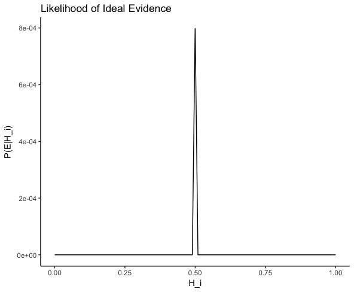
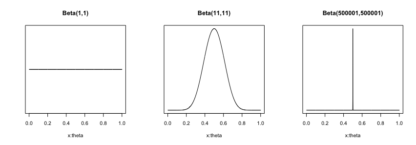

# Introduction

This chapter aims to discuss the issue of evidential *weight* in the context of *probabilism*, which is generally characterized as being committed to two theses:

1. The strength of a belief can be measured numerically as *degrees of belief*.
2. The rationality of degrees of belief is governed by the axioms of probability.

Since probabilism purports to be an overarching position about belief and its rationality, probabilists owe us an explanation for our existing epistemic practices.^[Even though 'probabilism' is often used as a synonymy for 'Bayesianism', I take the former to be a broader term than the latter. Bayesians are probabilists, but in addition, they also hold Bayes's Rule to be the *only* rational way to revise one's belief. To be more precise, I also distinguish *epistemic* Bayesians and *statistical* Bayesians, and in this paper when I use the term 'Bayesian', I typically have in mind a philosopher who holds the view about belief revision just described. A Bayesian *statistician* is also a probabilist - she might think that while belief comes in degrees and Bayesian statistics is the best framework for drawing inferences, not all beliefs can be meaningfully given a Bayesian analysis.] For each of these practices, probabilists either have to provide a probabilistic account for its rationality, or argue that we are better off without it.^[For instance, van Fraassen's argument that inference to the best explanation violates the axioms of probability. See [@vflawssym]]

One especially troublesome issue for probabilism is to account for the *weight* of evidence, which is roughly a measure of the *amount* of evidence, for this is often unreflected by probability. To see why, imagine two urns $A$ and $B$ with unknown proportions of black and white balls. Suppose you sample (with replacement) 30 balls from the urn $A$ and find 15 black balls and 15 white balls. Justifiably, you infer that the proportion of black balls in $A$ - call it $\theta_A$ is about $0.5$. You then decide to sample from $B$, but this time you only manage to draw 4 samples, 3 of which are black balls. Your best estimate for $\theta_B$ is $0.75$. At this point, I offer you another chance to draw from one of the urns, and if you manage to draw a black ball from that urn, you get a \$100. Which urn would you pick?

Clearly, $\theta_B > \theta_A$, but it is not clear that $B$ is obviously the better choice, because the amount of evidence you have for $\theta_A = 0.5$ is higher than for $\theta_B = 0.75$. This is a problem for probabilism, because, in terms of just comparing the probabilities alone, picking urn $B$ clearly has a higher probability of winning; however, all the facts in the situation are different than what the probability lets on, so the probabilistic approach overlooks some crucial information.

This introduces the distinction between the *balance* and *weight* of the evidence. The difference in numerical value between $\theta_A$ and $\theta_B$ is such that the balance of the available evidence points in favor of choosing $B$. But our judgment of $\theta_A = 0.5$ is based on more information, so it is *weightier*.

The aim of this chapter is to develop and examine a Bayesian solution to this problem that I call *Higher Order Relevance(HOR)*, which is a version of John Maynard Keynes's notion of conditional relevance. Briefly put, Keynes's idea is that for some evidence $E$ and hypothesis $H$

$$\text{Evidence $E$ is relevant to $H$ if and only if }P(H) \neq P(H|E)$$

HOR takes this on step further and suggests that, in addition to $H$ and $E$, consider a specific value $x$, where $0 \leq x \leq 1$

$$\text{Evidence $E$ has a higher order relevance to $P(H)=x$ iff}$$
$$P(P(H)=x) \neq P(P(H)=x|E)$$

Take the urn example from earlier, $E_A$ and $E_B$ - your respective evidence for $\theta_A$ and $\theta_B$ - have different degrees of HOR: the probability that $\theta_A = 0.5$ conditional on $E_A$ is much higher than $\theta_B$ conditional on $E_B$.

The brief sketch above contains a bit of simplification, but it does give credence to a tentative proposal that the weight of evidence is expressed not through first order probability but HOR. One goal of this chapter is to elaborate on this proposal by using Popper's *paradox of ideal evidence* as a test case. After the development of the notion HOR, however, I shall point out some defects that need to be addressed in a later chapter. Before doing so, however, let us introduce some important concepts in probabilism.

# Some Background in Probabilism

## The Rule of Succession

Laplace introduces the Rule of Succession as a model of induction. Laplace formulates the rule as follows:

> ...Thus one finds that when an event has happened any number of times running, the probability that it will happen again next time is equal to this number increased by 1, divided by the same number increased by 2.[@laplace, 11]

In other words, for a sequence of independent trials, Laplace recommends that we ought to update our belief by using the following principle. Suppose $H$ is the event of interest. After witnessing evidence $E$, we should update the prior probability $P(H)$ by calculating

$$ P(H|E) = \frac{1+x}{2+n}$$

Where $x$ is the number of successes observed out of n occurrences. While this result can be found in Bayes's posthumously published manuscript, Laplace's contribution is to generalize it as a principle of induction. Laplace even proposes to solve Hume's problem of induction with this particular rule: he says that to ascertain whether the sun will rise tomorrow, all we have to do is to calculate the probability that the sun will rise tomorrow, given it has always risen in the past. He assumes that the sun has never ceased rising in the past and that the earth, using the Bible as a source, is about 5000 years, or 1,826,213 days old. So he takes Hume's question to be asking for the probability that the sun will rise on the 1,826,214th day since the beginning of time, conditional on the fact that it has risen 1,826,213 times. So, $x=n= 1,826,213$, and the probability of the sun rising tomorrow is:

$$ \frac{1 + 1,826,213} { 2 + 1,826,213} =  \frac{1,826,214} {1,826,215} \approx 0.999999$$

Laplace's application of the rule here is not particularly convincing.^[According to @jaynes, 564, Laplace's use of this rule on the problem of induction is so wrong that it "has had a catastrophic effect" on his reputation. Peirce, for instance, says that Laplace's ideas had 'a great and deplorable influence' on the study of probability. [@CP, 8.220] But it seems that Laplace might have used that example in jest - see the discussion on the Principle of Indifference.] Nevertheless, the Rule of Succession is a particular instance of property of a Beta-Binomial distribution, which, as we shall see, is crucial to the discussion of HOR.

## The Principle of Indifference

Nevertheless, Laplace is quick to point out that the Rule of Succession is only applicable to anyone who knows absolutely nothing about planetary mechanics, for the use of the rule of succession requires the *the Principle of Indifference*:

> When the probability of a simple event is unknown, one may suppose that it is equally likely to take on any value from zero to one... the probability of each of these hypotheses, given the observed event, is a fraction whose numerator is the probability of the event under this hypothesis, and whose denominator is the sum of similar probabilities under each of the hypotheses.[@laplace, 20]

In other words, when we are in complete ignorance regarding the outcome of the event, the probability of each possible outcome is:

$$\frac{\text{1}}{\text{\# of total possible hypotheses}}$$

Since the sun either will rise or does not rise tomorrow, assuming the agent in question has no knowledge at all about the phenomenon of the sun rising, its probability of rising tomorrow would be $1/2$. The Principle of Indifference is presupposed by the Rule of Succession since, prior to observation, $x=n=0$, and we arrive at the same result:

$$ \frac{1 + 0} { 2 + 0} =  \frac{1} {2} $$

The Principle of Indifference has been harshly criticized. Peirce, for instance, argues that assigning the probability of $1/2$ to unknown events can lead to paradoxical results. Imagine, he asks, that there are inhabitants on Saturn and we would like to know the probability of a typical inhabitant's hair being red.  Since we are in total ignorance about their physiology, the principle says that this probability should be $1/2$, and according to Laplace we can update this probability by adding the number of inhabitants we observed to the denominator and the number of red-haired inhabitants to the numerator. However, we run into a paradox when we consider other hair colors: since we are ignorant about, say, whether their hair is blue, its probability should also be  $1/2$.  Assuming they can only have one hair color, this means that these are mutually exclusive events.  The sum of all of these probabilities would be more than 1, which contradicts the axioms of probability, creating a paradox. [@probabilityofinduction]

When Keynes wrote *A Treatise on Probability* many years later, he was keenly aware of these paradoxical results. However, he thinks that the paradoxes only suggest that the principle is to be restricted, not abandoned altogether. He argues that the reason that these paradoxes occur is because the Principle of Indifference should not be used when the alternatives under consideration can be further analyzed. Once all the alternatives are, in Keynes's words, *indivisible*, each of them should be assigned the probability of $1/n$, where n is the number of alternatives.[@keynes, 60]

Further, Keynes holds that probabilistic properties such as indifference between probabilities are Platonic entities that are acquired through intuition - not unlike Moore's non-natural normative properties.[@keynes, 11]  Keynes explains that there are two kinds of judgments we could make through direct acquaintance of logical relations.^[Keynes's view was deeply influenced by Russell's logical atomism and Moore's intuitionism, the dominant views at Cambridge when he was thinking about issues in probability.  Probability, in Keynes's view, is defined as a logical relation between a premise and a conclusion. Probability relations are logical, because this relation belongs to the same conceptual category as the entailment relation between the premises and conclusion in a deductive argument. The difference here is one of degrees: in a derivation in deductive logic, the set of premises *fully* entails its conclusion. In probabilistic reasoning, the set of premises *partially* entail its conclusion, so in this view a probability is conceived as the degree of a partial entailment. This assumption about probability relations is the basis of a rule of rationality that governs that degrees if belief: the degrees of a belief should correspond to degrees of entailment that the belief receives as a conclusion in an argument. See first 2 chapters of @keynes and @gilliesbook, 33] We make *judgment of indifference*  when we intuit that two probabilities are identical.[@keynes, 60]  In other words, Keynes holds that we can judge that the two probability relations are equal when we perceive that

$$ P(H_1|E) = P(H_2|E) $$

Note that this judgment is not used to justify the Principle of Indifference. Keynes intends it to be the other way around: the judgment of indifference is correctly applied only if the conditions for the Principle of Indifference are satisfied.

## Conditional Relevance

The other kind of logical relations a competent perceiver can know through acquaintance is the *judgement of relevance*, which is the perception about a premise's evidential relevance to its conclusion. This is critical for Keynes's defense of the Principle of Indifference, because it gives intelligibility to his idea of indivisibility. The intuition Keynes wants to capture is that, when we ask if the alternatives are divisible, we do not really mean conceptual or physical divisibility, but probabilistic divisibility: an indivisible alternative is one where no other facts can be perceived as having an effect on its probability.  Keynes's example is that, in a typical urn example with some black and white balls, if we want to know the probability of a white ball being randomly chosen, it does not really concern us whether or not the ball is made of iron of or tin. [@keynes, 59]

So, According to Keynes, the use of the principle in Peirce's example is not legitimate, because the probabilities should be $1/n$, where n is number of possible colors, not $1/2$.  In this case of their hair color being red or not, we can see that being not-red can be analyzed into being blue, being yellow, etc., because we can see that being blue is evidentially relevant to not being red.

So, the intuition is that *only relevant evidence should change the probability of proposition in question*, and Keynes goes one step further by explicating the notion of relevance as how the probability of the proposition changes conditional on the evidence. Evidence $E$ is relevant to the proposition $H$ if and only if:

$$P(H|E) \neq P(H) $$

The idea is that if $E$ is relevant to $H$ in any way, when we consider them together $H$ probably should be different than the probability of $H$ considered alone. So, more precisely, the probability of $H$ given $E$ should be different than the unconditional probability $H$. It should also be obvious that $E$ is irrelevant to $H$ if and only if

$$P(H|E) = P(H) $$

Note that this means $E$ can be relevant to $H$ in two different ways, because $P(H|E)$ can be greater or smaller than $P(H)$. This makes intuitively sense, because if $H$ becomes less probable with $E$ in the background, then it means $E$ disconfirms, and therefore is relevant to, $H$.

# Can Conditional Relevance Account for the Weight of Evidence?

## The Paradox of Ideal Evidence

Popper, however, has argued that the Keynesian notion of relevance is incompatible with how the weight of evidence works. Popper frames the issue as the *paradox of ideal evidence*.[@popperlogic, 425] He asks us to consider a certain coin with an unknown bias: let $N$ be the proposition "the next toss of the penny will yield heads". Now, what should $P(N)$ be? He suggests, either by appealing to intuition, or the Principle of Indifference, it ought to be clear that $P(N) = 0.5$.^[It should be noted that Popper is not attacking the principle of indifference in this context. That is, for this argument he is willing to grant that Bayesians have some way of arriving at $P(N)$ - it could be by indifference, through elicitation, etc.]

Now let $I$ be what he calls *the ideal statistical evidence* in favor of the idea that the coin in question is a fair one. Popper's example is to let $I$ be the proposition that 'in a million tosses, the coin landed on heads roughly half a million times.' The exact number is not important, as long as the number of heads and tails would make it practically certain that the coin is fair  - the same point could be made using 10 millions instead of a million. Now, Popper asks, given we have ideal evidence $I$, what is the probability of $N$? He claims that it would have to be $1/2$. So

$$P (N|I) = P(N) = \frac{1}{2}$$

\noindent However, as discussed earlier, evidence $E$ is irrelevant to the hypothesis $H$ if and only if

$$ P(N|I) = P(N) $$

\noindent If $P(N|I) = P(N) = 1/2$, this means that the ideal evidence is also irrelevant evidence. Popper then concludes:

> Now this is a little startling; for it means, more explicitly, that our so-called ‘degree of rational belief’ in the hypothesis, [$N$], ought to be completely unaffected by the accumulated evidential knowledge, [$I$]; that the absence of any statistical evidence concerning [the hypothesis that the coin is fair] justifies precisely the same ‘degree of rational belief’ as the weighty evidence of millions of observations which, prima facie, support or confirm or strengthen our belief. [@popperlogic, 426]

\noindent To summarize, we can interpret Popper to be making the following claims:

1. $I$ is ideally favorable to $N$.
2. $P(N|I) = P(N) = 1/2$.
3. $I$ is conditionally irrelevant to $N$.

\noindent There is an aura of plausibility to this argument; however, it is not exactly clear what the paradox is exactly. So let us flesh out Popper's argument.

## Analyzing Popper's Argument

To begin, we should ask: is $I$ ideally favorable to $N$?  The problem is to find a way to make sense out of this "ideally favorable" relation without begging the question against probabilism, for the probabilist's notions of the relevance and confirmatory favorability are both closely tied to conditionalization. Generally speaking, for probabilists, or more specifically, epistemic Bayesians, $X$ confirms $Y$ if and only if $X$ conditional on $Y$ has a higher probability than just the probability of $X$ alone, so by definition if $X$ confirms $Y$, then $X$ is relevant to $Y$. So, as the argument stands, there is nothing stopping the Bayesian from biting the bullet and insisting that $I$ is irrelevant to $N$, or that $I$ was never ideally favorable to begin with, so Popper needs to motivate an external notion of favorability to establish premise 1, from which we can (supposedly) derive a contradiction.

Here's my suggestion: to give some credence to premise 1, we can use the statistical notion of *likelihood*, which refers to the probability of the evidence *given* a particular hypothesis. In general, we are interested in the probability of the hypothesis we are interested in, but sometimes we also reason by thinking about the probability of the evidence that we have, conditional on the hypotheses. In other words, another way of thinking about probabilistic favorability is to ask if it makes sense to have gathered the evidence we did, had the hypothesis in question been the correct one.

A widely used method, due to R.A. Fisher, called the maximum likelihood estimation(MLE) can help us here. The intuition is to ask ourselves which possible value of $N$, were it true, would have the maximum chance to give rise to the data $I$ we currently have. In other words, let $\theta_i$ be the hypothesis that $P(N)=i$ where $i\in(0,1)$ - we want to pick a $H_{mle}$ such that the choice will give the maximum value of

$$P(I|H_{mle})$$

\noindent out all possible $H_i$s.

Formally, getting the maximum likelihood estimate requires differentiating the distribution function and then set to zero. Fortunately, for the kind of trials Popper has in the mind, the maximum likelihood estimate is known to be the mean of the sample. In our case, it would essentially be $1/2$. To further convince ourselves, we can plot all possible hypotheses for $N_i$ against the corresponding $P(I|H_i)$, as shown in Figure 1.

{width=400 height=300}

Here we see that unless the coin was, or extremely close to being, fair, it would simply be impossible for $I$ to come to be true. This means that, were the coin biased in some way, it would require nothing short of a Humean miracle to get a practically perfect 50:50  split of heads and tails out of *one million tosses*. So to strengthen Popper's argument, we could say that $I$ is the ideal evidence for $H_{0.5}$, that is, the coin is perfectly fair; because the character of $I$ is such that it makes $H_{0.5}$ practically a necessary condition. This, I think, captures Popper's idea that $I$ is ideal evidence for $P(N|I) = 0.5$ in a sense that we have "no other option" than to think that it is true. [@popperlogic, 425]

We have established that $I$ is ideal evidence for hypothesis $H_{0.5}$, that the coin is fair. Still, a paradox is nowhere to be found. Nevertheless, even though he never comes out and state it explicitly, it is not hard to see that Popper is suggesting that the paradox is $I$ is both relevant and irrelevant at the same time, so the argument is really the following:

1. $P(N) = 1/2$.
2. $I$ is ideally favorable to $P(N) = 1/2$.
3. $I$ is evidentially relevant to $P(N) = 1/2$.
4. $P(N|I) = 1/2$
5. $I$ is evidentially irrelevant to $P(N) = 1/2$.

Premise 1 is justified by either the Principle of Indifference or appealing to a subjective prior. Without the principle of indifference, a probabilist may say that $P(N)$ can be anything as long as it is between $0$ and $1$, and if it is something other than $0.5$, then premises 1 would be false. But it is hard to see how this can be justified. To begin, $0.5$ seems to me the most reasonable prior probability one can assign to $P(N)$, with or without the principle of indifference. For the sake of the argument, let's say it begs to the question to assume $0.5$ is the most reasonable prior, but it would also be *ad hoc* to suggest that it cannot be $0.5$ simply to avoid the paradox.

I have argued for premise 2. I suggest that Popper intends premise 3 to be a consequence of premise 2. Now the issue of question begging arises again. Clearly, if we simply look at the probabilist notion of conditional relevance provided by Keynes, 3 is simply not true by definition, so Popper must be appealing to some sense of *evidential* relevance external to the Bayesian framework, and to avoid equivocation we must then also insist that the same sense of relevance is employed in premise 4.

## Problem with Popper's Argument

 Nevevtheless, Popper's argument contains a  sleight of hand that shifts between two ways of thinking about $N$'s probability. The argument begins by asking, rather innocuously, for your prior for $N$, but the ideal evidence $I$ Popper immediately introduced is not for $N$ but for the hypothesis $H_{0.5}$. Popper is explicit about *that*, but what he is not explicit about is *this*: he has convinced us that $I$ is both evidentially ideal and relevant to $H_{0.5}$, but that's a misdirection, because immediately he starts talking the conditional probability on $I$, *not* of $H_{0.5}$, but of $N$. So Popper's paradox is *really* as follows:

 1. $P(N) = 1/2$.
 2. $I$ is ideally favorable to $P(H_{0.5})$.
 3. $I$ is evidentially relevant to $P(H_{0.5})$.
 4. $P(N|I) = 1/2$
 5. $I$ is evidentially irrelevant to $P(N) = 1/2$.

 \noindent But now there is no contradiction - $I$ is relevant to $H_{0.5}$ but irrelevant to $N$.

 Furthermore, the very idea of $P(N|I)$ seems intelligible, only because we were distracted by the fact $P(H_{0.5}|I)$ *is* intelligible. But intelligibility of the latter is not the same as the former: the scenario Popper describes involves the updating of $N$, that the toss will be heads, by conditionalizing on $I$, that half a million heads were tossed out of a million trials. Suppose we carry this out by explicating $P(N|I)$ using Bayes' theorem:

 $$P(N|I)=\frac{P(N) P(I|N)}{P(I)}$$

  This means that to get $P(N|I)$ using Bayes' theorem, we would need to assign a value to $P(I|N)$, the absurdity of which is perhaps obscured by the symbolization - but what could be the probability that half a million heads will be tossed in a a million trials, given the next toss is heads?

  Two responses could be made on Popper's behalf. The first is that if $P(N|I)$ is nonsensical, then so much the worse for the probabilists, because *they* are the one holding that all beliefs can be assigned a precise degree of belief. I think this is a very serious problem, which I will discuss in the last section of this paper.

  The second response is that probabilists still owe us an account for (new) premises 2 and 3, that is, if $I$ is evidentially relevant to $P(H_{0.5})$, then the following inequality should hold:

  $$P(H_{0.5})\neq P(H_{0.5}|I)$$

 \noindent which is the definition Higher Order Relevance introduced earlier. I shall demonstrate the above inequality in the next section.
<!-- # Severity as a Frequentist Notion of Weight

## Peirce's Probable Error

## Severity as a Frequentist Notion of Weight -->

# Higher Order Relevance

De Morgan points out that sometimes it makes sense to speak of the *probability of a probability*.[@demorgan, 87]  He asks us to imagine 100 urns, of which only one urn - call it $M$ -  has an equal proportion of black and white balls and others have various other proportions with the same two colors. If I were to random draw a ball from $M$,the probability of $B$, that a black ball is drawn, would be 0.5. But suppose the urns are indistinguishable from each other, and I can only randomly pick one without knowing if it is really $M$. We are uncertain if the probability of getting a black ball is 0.5, but we do know enough to quantify this uncertainty: since I am randomly picking one urn out of 100, the probability of *the probability of B is 0.5* is $1/100$.

@savage expresses a similar sentiment:

> ...there seem to be some probability relations about which we feel relatively "sure" as compared with others. When our opinions, as reflected in real or envisaged action, are inconsistent, we sacrifice the unsure opinions to the sure ones. [@savage, 57-58]

Nevertheless, Savage urges caution on introducing higher orders of probability, due to its technical technical challenges:

> The notion of "sure" and "unsure" introduced here is vague, and my complaint is precisely that neither the theory of personal probability, as it is developed in this book, nor any other device known to me renders the notion less vague. There is some temptation to introduce probabilities of a second order so that the person would find himself saying such things as "the probability that B is more probable than C is greater than the probability that F is more probable than G." But such a program seems to meet insurmountable difficulties. [@savage, 58]

 Issues regarding higher order probabilities are beyond the scope of this paper - my proposal is that we ought to defer to the actual practice of Bayesian statistics, which treats *parameters* of a model as random variables - quantities from a random process that could be measured using probability and statistics. More importantly, these parameters could be *hyperparameters* - parameters of a probability distribution *for* another parameter. Thus, in actual practice, it is a commonplace to give a probabilistic reading of (say) the mean $\mu$ and the standard deviation $\sigma$ of a Normal distribution. Bayesian methods allow us to speak sensibily about "the probability of the mean $\mu$ being x", a statement that would be a mere gibberish in the Frequentist framework.

The kind of trials involved in the paradox of ideal evidence can be modeled as Beta-Bernoulli process, where the Beta distribution would model our state of belief and the Bernoulli distribution the coin tossing process. The Bernoulli distribution has the parameter $\theta$, which is often interpreted as the probability of success of a binary event, e.g., landing on heads, and thus in this sense we are talking probabilities of a probability. But, as Lindley points out, this is a confused way of talking about probability in a Bayesian context, instead we should think of the parameter $\theta$ as representing the *propensity* of the coin. We then use the Beta distribution to model the propensity, representing the degree of our belief in various hypotheses of $\theta$ having a certain value $x$ where $0 \leq x \leq 1$.

More precisely, let $\theta$ be the propensity of the coin to land on heads and let

$$
X_i =
\begin{cases}
   1       & \quad \text{the coin lands on heads on toss $i$,}\\
   0 & \quad \text{otherwise.}
 \end{cases}$$

Now these random variables can be modeled as follows:

$$\theta \sim Beta(\alpha, \beta)$$
$$X_1,...X_i \sim Bern(\theta)$$

The Beta distribution has two parameters, $\alpha>0$ and $\beta>0$, which can be thought of as, in our context, our past experience about the coin's propensity. For instance, $\alpha = \beta = 1$ is equivalent to a uniform distribution (Figure 1 below), which captures the Principle of Indifference. Furthermore, the Beta distribution, because it is a *conjugate prior* for the Bernoulli distribution, provides a simple way to update the prior distribution based on data gathered from a Bernoulli process. That is, take any arbitrary $\alpha$ and $\beta$ for the Beta distribution - the prior distribution $p(\theta)$ and some data $x$ gathered from a Bernoulli process. Its posterior distribution

$$ p(\theta|x) = \frac{p(\theta)p(x|\theta)}{\int p(\theta')p(x|\theta')}$$

is simply $Beta(\alpha + k, \beta + n - k)$ - a Beta distribution with parameters $\alpha$ plus the number of heads $k$ and beta the number of tails.

Furthermore, the Beta distribution is an expression of Laplace's rule of succession, discussed earlier. This is because its expected value has the form:

$$E(\theta) = \frac{\alpha}{\alpha + \beta}$$

\noindent Now, because of conjugacy, the *posterior* expected value is simply:

$$E(\theta) = \frac{\alpha + k}{\alpha + \beta + n}$$

\noindent where $x$ is the number of success and $n$ is the number of trials. If we assume a *uniform prior*, where both parameters equal to $1$, the above formula becomes:

$$E(\theta) = \frac{1 + k}{2 + n}$$

\noindent That is, Laplace's rule of succession. We can now reframe the paradox of ideal evidence using the Beta and Bernoulli distributions. Consider three beta distributions:

1. $Beta(1,1)$:
2. $Beta(11,11)$
3. $Beta(500,001,500,001)$

Note that all three distributions have the same expected values:

$$\frac{1 + 0}{2 + 0}=\frac{1 + 10}{2 + 10}=\frac{1 + 500000}{2 + 1000000}=\frac{1}{2}$$

However, even though these distributions produce identical expected values, if we plot them, we can see that how they represent states of belief that are drastically different:

{width=400 height=300}

Intuitively, we can think of the first distribution as representing your state of belief about the probability of getting a head on the next flip. This distribution is plotted in Figure 1: note that it is wholly flat, capturing the sort of judgement of indifference that Keynes talks about. One finds no ground in thinking one probability is more credible than another.

The second distribution can be seen as our state of belief after witnessing 10 flips of the coin, and 5 turn up heads and 5 tails. Naturally, the peak - the mode of the distribution - is at $\theta = 0.5$, which seems sensible, because it reflects the evidence that exactly half of the samples is heads. But we can see that at this stage we are quite uncertain about $\theta$, evidenced by the width of the distribution. While $\theta = 0.5$ is the peak, there is a substantial area covering $\theta > 0.55$ and $\theta < 0.45$.

The third distribution, modeling the state of belief after one million trials with half of them being heads, is intended to be an approximation of Popper's ideal evidence scenario. The peak is again at $0.5$, but this plot has a noticeably narrower spread: we are much more confident in our assessment that the coin has an equal propensity to land on heads as tails. Also notice that at this stage, any value of $\theta$ other than $0.5$ are practically impossible after receiving the ideal evidence. This is in harmony with the MLE.

To state these observations more precisely, we can calculate the exact probability using the corresponding cumulative distributions. Since Beta distributions are continuous distributions, we can only deal with intervals of values, but we can provide a reasonably close approximations. For instance, conditional on the ideal evidence, we would be absolutely sure that the probability is between 0.46 and 0.54, and practically certain, with the probability of 0.95, that it is between 0.49 and 0.51. The relevant probabilities are summarized in the following table:

|      Distribution | $P(0.46<\theta<0.54)$ | $P(0.49<\theta<0.51)$ |
| ----------------: | --------------------: | --------------------: |
|       $Beta(1,1)$ |                $0.08$ |                $0.02$ |
|       $Beta(11,11)$ |                $0.29$ |                $0.07$ |
| $Beta(500001,500001)$ |                   $1$ |                $1$ |

Now, let $E$ be the ideal evidence, $X_1,…X_{1000000}$, where $\sum_{i=1}^{1000000}X_i = 500000$, and let $\theta$ be the coin's propensity to land on heads. We now see that the following inequality holds, since the left-hand side is $0.02$, and for the right it's $1$.

$$P(0.49<\theta<0.51) <  P(0.49<\theta<0.51|E)$$

which satisfies the criterion of success stated at the end of the last section.

# Does HOR sufficiently capture evidential weight?

While I think that HOR provides an able response to Popper's paradox, it is not quite the same as accounting for the phenomenon in question. In fact, by focusing overcoming the difficulty raised by the paradox caused by an absurd amount of evidence, we might have overlooked what is truly at stake: rarely, if ever, do we have ideal evidence for any substantive hypothesis, so situations where we have an overabundance of evidence is an incomplete benchmark for the adequacy of the account. In fact, our analysis shows that when we have perfect information, evidential weight essentially becomes a non-issue, because it eliminates the uncertainty that calls for probabilistic reasoning to begin with.

The important question, instead, is whether HOR can help decision making in situations where evidence is severely lacking. To this end, it remains to be demonstrated as to how higher order relevance can trickle down to first order probability, on which decision making are based within the classical Bayesian framework.

This issue can be demonstrated in two ways. First, this can be seen by returning to a problem that came up during the analysis of the logical structure of Popper's argument. I raised the objection that it absolutely makes no sense to talk about the probability of $I$, the ideal evidence scenario, given the next coin is going to land on heads. The problem with that, again, is that it is the fundamental assumption of probabilism that belief comes in degrees, so the absurdity of the $P(I|N)$ is actually a bigger problem for probabilism, and Popper would be more than happy to concede that no precise probability can be assigned to this.

The second way to think about this issue is to ask ourselves if HOR as a concept can make any practical difference in decision making, and the answer is that it is in fact difficult to do so without violating the basic framework of Bayesianism. To see this, imagine a contest in which you will win a prize if a coin flip lands on head. You are given a choice between two coins: the first coin $P$ is similar to Popper's coin from the ideal evidence scenario, except now the ideal evidence actually show that there is a slight bias against heads, say $E(\theta_P) = 0.48$. The other coin $U$ is that you never seen before, so on an ignorance prior your expected value $E(\theta_U)$ is 0.5 .  Now, which would you choose? The intuitive answer is that you probably still want the Popperian coin, because you know you are getting $\theta = 0.48$ almost for certain. From a Bayesian perspective, however, it is hard to rationalize such a decision, because the Popperian coin still has a lower expected value. That is,

$$\frac{480000}{1000000}< \frac{1}{2}$$

So it seems that we are back to where we started - the relevance demonstrated on a higher order simply vanishes when we consider the matter on the level of decision making, which is entirely based on a precise point-estimate of the first order probability.

If the point estimate is to be blamed, the natural response is that we do rely on an interval estimate instead. This solution is reminiscent of the call to abolish the use of $p$ values in Frequentist statistics, and instead we should report the confidence interval of our findings. The idea is that point estimates are inherently misleading, since they, by design, summarize the data by discarding information such as higher order relevance. This problem is somewhat analogous to the one we are running into with respect to expected values. So one possible solution is that we should only insist on making our decisions based on *credible intervals*, which is the Bayesian version of the confidence interval. For instance, suppose $\theta_P \sim Beta(480000,520000)$ and $\theta_U \sim Beta(1,1)$. We then can deduce that

$$P(0.479\leq \theta_P \leq 0.481) = 0.99$$
$$P(0.005\leq \theta_U \leq 0.995) = 0.99$$

\noindent In other words, we can say there is a 0.99 probability that $P$'s propensity to land on heads is between 0.479 and 0.481 (practically 0.48) and for $U$ it's between 0.005 and 0.995.

However, it seems to me that we are simply restating high order relevance in terms of credible intervals, without dealing with the crux of the problem - unless we are rationally allow to refuse to assign a precise probability to a belief, even if the weight of evidence is low, we will always have to match it to our best point estimate, which is the expected value.

The seemingly obvious solution is that perhaps we should discount our degrees of belief based on the higher order relevance. So perhaps my subjective probability for the proposition 'coin $U$ will lands on heads' should be something other than $0.5$, perhaps a lower value such that it makes choosing $P$ more rational. The problem is that Bas van Fraassen has shown that this is a violation of the (Special) Principle of Reflection, that is,

$$P(A|p_t(A) = x) = x$$

In other words, your subjective probability for any $A$ is such that its value must be equal to the probability you expect to have at some future time $t$.[@reflection2] For any Bayesian agent, this is equivalent to

$$P(A)= E(P(A))$$

\noindent That is, the expected value of $A$. The violation of the Principle of Reflection has been shown to imply incoherence.[@reflection1]

I think the conclusion here is that HOR cannot capture the notion of evidential weight *as long as we are committed to classical Bayesianism*, and a viable alternative is the subject of the investigation for the next chapter.

# Reference
