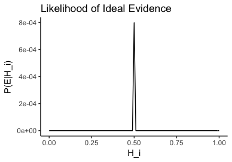

# Historical Background

## Bayes, Hume, and Balancing Reasons

Even though Keynes is usually credited as the first person who noted the distinction evidence *balance* and evidential *weight*, an informal version was mobilized by Hume in his argument against miracle and formalized by Peirce in his critique of conceptualism in probability. The idea of balancing reasons, intuitively, is this:
dsds
### The Balance of Reasons

If we have a sufficient amount of evidence, we should be able to judge whether our overall evidence points in favor of or against the hypothesis in question. Both Keynes and Peirce make use of the metaphor of the balance of reasons. The idea is that we should be able to put all evidence on a metaphorical scale and see which side comes out on top: if our overall evidence is in general favorable to the hypothesis, then the balance of reasons should point to the same direction.

 Peirce explicates the balance of the evidence as the *log-odds* of a belief. Take some arbitrary belief $A$, for instance. Suppose we start with $P(A) = 1/2$. The prior odds would be

$$\frac{P(A)}{1- P(A)} = \frac{1/2}{1/2} = 1:1$$

Suppose $E$ is new evidence for $A$. Now, given a prior odd of 1:1 for $A$, the posterior odd for $A$, $\frac{P(A|E)}{P(\neg A |E)}$ can be algebraically reformulated as the likelihood ratio: $\frac{P(E|A)}{P( E| \neg A)}$. After taking the log of the odds as Peirce suggested, we can find the balance of reasons by calculating $log(P(E|A)) - log(P(E|\neg A))$. A positive value means the evidence is in favor of A and negative against it.

The log-odds also has a nice way of representing the intuition that independent reasons for a belief should be additive. The idea  is that the strengths of two independent pieces of evidence should be combinable to increase the degree of the belief in question. This is also accounted for by Peirce's idea of log-odds. Suppose $E_1$ and $E_2$ are independent evidence for $A$. This can be captured by the idea of *conditional independence*:

$$P(E_1 \wedge E_2 |A) = P(E_1|A) P(E_2|A)$$

Now, if we take the logarithm of the product, the product becomes $log(P(E_1|A))+ log(P(E_2|A))$.  This captures the intuition that adding two pieces of independent evidence together should increase the intensity of our belief.

## Peirce, Laplace, and the Principle of Indifference

Peirce gave John Venn's *The Logic of Chance* a glowing review: 'a book which should be read by every thinking man.''[@vennlogicreview, 98] Venn earned Peirce's praise by advancing an objective interpretation of probability, which analyzes the concept as a relative frequency, against the conceptualist who holds that probabilities are degrees of credences. The conceptualists take their cues from Laplace, who in turns draws from Thomas Bayes himself.

The 1867 review marks the beginning of Peirce's public opposition to conceptualism He eventually gives his thoughts on conceptualism a full articulation about ten years later in 'Probability of Induction.' It is in this paper that the very idea of the weight of the evidence is first explicitly discussed in the context of probability. It is therefore appropriate to set the stage by giving some historical and conceptual background on this dispute between the early proponents of the two interpretations of probability - one that is still very much with us today.

### Laplace's Rule of Succession

In a letter to Peter Carus, Peirce explains that one of the main targets he had in mind when attacking conceptualism was Laplace's view in *A Philosophical Essay in Probability*, which, Peirce says, had 'a great and deplorable influence.'[@cp, 8.220] Even though Peirce does not mention Laplace directly in 'Probability of Induction,' that he has Laplace in mind is not surprising, since Peirce spends a great deal to attack ideas originated from Laplace.

In the beginning chapter of *A Philosophical Essay on Probabilities*, Laplace proposes the so-called "rule of succession."  This rule is adopted by the conceptualists as a model for belief revision based on new evidence. Laplace formulates this as follows:

> Thus we find that an event having occurred successively any number of times, the probability that it will happen again the next time is equal to this number increased by unity divided by the same number increased by two units.

In other words, for a sequence of independent trials, Laplace recommends that we ought to update our belief by using the following principle. Suppose $H$ is the event of interest. After witnessing evidence $E$, we should update the prior probability $P(H)$ by calculating

$$ P(H|E) = \frac{1+x}{2+n}$$

Where x is the number of successes observed out of n occurrences.

Laplace, using an example that "has had a catastrophic effect" on his reputation, illustrates this by calculate the probability of the sun rising.[@jaynes, 564]He assumes that the sun has never ceased rising in the past and that the earth is about 5000 years, or 1,826,213 days old, so this means $x=n= 1,826,213$, so the probability of the sun rising is:

$$ \frac{1 + 1,826,213} { 2 + 1,826,213} =  \frac{1,826,214} {1,826,215} $$

Even someone who is sympathetic to subjective interpretations of probability, this example seems off because this appears to say that if a bet against the sun rising at odds of $ 1826214:1$ were to be offered to someone, she would be irrational not to take it.

### The Principle of Indifference

Nevertheless, Laplace suggests that for most people, the rule of succession is not the right rule to use the estimate their posterior probability of the sun rising. He says that anyone "recognizing the totality of phenomena the principal regular of days and seasons, sees that nothing at the present moment can arrest the course of it" [laplace, 19]. Presumably, this means that anyone who knows anything about planetary motion would not be rational to use the rule of succession to ascertain her personal probability for the sun rising tomorrow. Laplace is perhaps suggesting that only in complete ignorance about the event in question is one entitled to use the rule of succession. This places a restriction in the applicability of the rule.

Perhaps this is why the rule of succession does not receive any direct criticism from Peirce; instead, he focuses on another rule presupposed by it, that is, the principle of indifference, which is the idea that we should assign the probability of 0.5 to any totally unknown event. This can be seen by appealing the rule of succession in a case where no observation has been made, which means

$$ \frac{1 + 0} { 2 + 0} =  \frac{1} {2} $$

This means that prior to any observation, the probability of any event of which we are know nothing should be 0.5, so the rule of succession presupposes the principle of indifference. This is how Laplace formulates it:

> When the probability of a simple event is unknown, one may suppose that it is equally likely to take on any value from zero to one... the probability of each of these hypotheses, given the observed event, is a fraction whose numerator is the probability of the event under this hypothesis, and whose denominator is the sum of similar probabilities under each of the hypotheses

This principle is harshly criticized by Peirce, who argues that assigning the probability of $1/2$ to unknown events can lead to paradoxical results. Imagine, he asks, that there are inhabitants on Saturn but we would like to the probability of a typical inhabitant's hair being red .  Since we are in total ignorance about their physiology, the principle says that this probability should be $1/2$, and according to Laplace we can update this probability by adding the number of inhabitants we observed to the denominator and the number of red-haired inhabitants to the numerator. However, we run into a paradox when we consider other hair colors: since we are ignorant about, says, whether their hair is blue, its probability should also be  $1/2$ .  Assuming they can only have one hair color, this means that these are mutually exclusive events,  the sum of all of these probabilities would be more than 1, which contracts with the axioms of probability, creating a paradox. We shall return to this problem in our discussion of Keynes.

### Peirce on Weight and Balance

## Keynes and the Weight of the Evidence

### The Indivisibility Requirement

When Keynes wrote *A Treatise on Probability*, he was keenly aware of these paradoxical results. However, he thinks that the paradoxes only suggest that the principle of indifference is to be restricted, not abandoned altogether. He argues that the reason that these paradoxes occur is because the principle of indifference should not be used when the alternatives under consideration can be further analyzed, and once all the alternatives are, in Keynes's words, *indivisible*, each of them should be assigned the probability of $1/n$, where n is the number of alternatives.[@keynes, 60]

Keynes's solution is influenced by Russell's logical atomism and Moore's intuitionism, the dominant views at Cambridge when he was thinking about issues in probability.[@gilliesbook, 33]  Probability, in Keynes's view, is defined as a logical relation between a premise and a conclusion. Probability relations are logical, because this relation belongs to the same conceptual category as the entailment relation between the premises and conclusion in a deductive argument. The difference here is one of degree: in a derivation in deductive logic, the set of premises fully entails its conclusion. In probabilistic reasoning, the set of premises partially entail its conclusion, so in this view a probability is conceived as the degree of a partial entailment. [@keynes, 30] This assumption about probability relations is the basis of a rule of rationality that governs that degrees if belief: the degrees of a belief should correspond to degrees of entailment that the belief receives as a conclusion in an argument. [@keynes, 3]

More important, these logical probability relations are Platonic entities that are acquired through intuition - not unlike Moore's non-natural normatively properties. Russell's influence manifests itself through Keynes's appeal to the distinction knowledge by acquaintance and by description. [@keynes, 11] To begin, Keynes explains that there are two kinds of judgments an agent could make through direct acquaintance of logical relations. The first is the *judgment of indifference*, which is simply what the Principle of Indifference aims to justify.[@keyes, 60] In other words, Keynes holds that we can judge that the two probability relations are equal when we perceive that

$$ P(H_1|E) = P(H_2|E) $$

Note that this judgment is not used to justify the Principle of Indifference. Keynes intends it to be the other way around: the judgment of indifference is correctly applied only if the conditions for the Principle of Indifference are satisfied. The other kind of logical relations a competent perceiver can know through acquittance is the *judgement of relevance*, which is the perception about a premise's evidential relevance to its conclusion. This is critical for Keynes's defense of the principle of indifference, because it gives intelligibility to his idea of indivisibility. The intuition Keynes wants to capture is that, when we ask if the alternatives are divisible, we do not really mean conceptually physically divisible, but probabilistically: an indivisible alternative is one where no other facts can be perceived as having an effect on its probability.  Keynes's example is that, in a typical urn example with some black and white balls, if we want to know the probability of a white ball being randomly chosen, it does not really concern us whether or not the ball is made of iron of or tin. [@keynes, 59] In other words, the material of the ball is irrelevant, and he thinks that this is something we can intuitively grasp. We will discuss the technical details of evidential relevance in the next section.

So, According to Keynes, the use of the principle in Peirce's example is not legitimate, because the probabilities should be $1/n$, where n is number of possible colors, not $1/2$.  In this case of their hair color being red or not, we can see that being not-red can be analyzed into being blue, being yellow, etc., because we can see that being blue is evidentially relevant to not being red.

### Relevant and Irrelevant Evidence

Some evidence is more relevant than others. A probabilistic explication of the concept of evidential relevance was spelled out by Keynes and has subsequently been accepted by modern Bayesian. His example is that, in a typical urn example with some black and white balls, if we want to know the probability of a white ball being randomly chosen, it does not really concern us whether or not the ball is made of iron of or tin. [@keynes, 59] In other words, the material of the ball is irrelevant, so this is an example of judgment of irrelevant in action.

 So, the intuition is that *only relevant evidence should change the probability of proposition in question*, and Keynes goes one step further by explicating the notion of relevance as how the probability of the proposition changes conditional on the evidence. Evidence $E$ is relevant to the proposition $H$ if and only if:

**Conditional Relevance(CR):**$$P(H|E) \neq P(H) $$

The idea is that if $E$ is relevant to $H$ in any way, when we consider them together $H$ probably should be different than the probability of $H$ considered alone. So, more precisely, the probability of $H$ given $E$ should be different the unconditional probability $H$. It should also be obvious that $E$ is irrelevant to $H$ if and only if

$$P(H|E) = P(H) $$

Note that this means $E$ can be relevant to $H$ in two different ways, because $P(H|E)$ can be greater or smaller than $P(H)$. This makes intuitively sense, because if $H$ becomes less probable with $E$ in the background, then it means $E$ disconfirms, and therefore is relevant to, $H$.

### Weight and Relevance

Keynes recognizes that his idea of evidence relevance leads to some implausible consequence when evidence weight is involved. The increase of weight should correlate the accumulation of *relevant* evidence - ideally adding irrelevant information to our body of evidence should not increase its weight. Keynes points out that they sometimes come apart.

# The Paradox of Ideal Evidence

## Popper's Presentation

The tension between probabilism and evidential weight culminates in Popper's *paradox of ideal evidence*.[@popperlogic, 425] He asks us consider a certain penny and let $N$ be  the proposition "the next toss of the penny will yield heads". The proponents of subjective probability, against whom he is arguing, would suggest that the prior probability should be $P(N) = 0.5$. Now let $I$ be what he calls *the ideal statistical evidence* in favor of the idea that the penny in question is a fair one. The actual evidence itself is not of huge importance - it just has to be some sort of statistic that would leave very little doubt that the penny is fair.

Popper's example is to let $I$ be the proposition that out a million tosses, somewhere between half a million plus or minus twenty yield heads. The actual number is not important: what matters is that we have a large number of trials with a equal number of heads and tails - the same point could be made using 10 millions instead of a million. Now, Popper asks, given we have ideal evidence $I$, what is the probability of $N$? He claims that it would have to be $1/2$.

$$P (N|I) = P(N) = 0.5$$

Before discussing exactly what is wrong with this picture, it should be noted that Popper is not attacking the principle of indifference in this context. That is, for this argument he is willing to grant that Bayesians have some way of arriving at $P(N)$ - it could be by indifference, through elicitation, etc. So Popper's argument, unlike Peirce's, does not hinge on whether the use of the principle of indifference is permissible. I take it to be a strength of Popper's argument.

Nevertheless, Popper is zeroing in on a different Bayesian idea that the degree of *relevance* of evidence can be measured in terms of conditional probability. As discussed earlier, evidence $E$ is irrelevant to the hypothesis $H$ if and only if

$$ P(N|I) = P(N) $$

If $P(N|I) = P(N) = 1/2$, this means that the ideal evidence is also irrelevant evidence. Popper then concludes

> Now this is a little startling; for it means, more explicitly, that our so-called ‘degree of rational belief’ in the hypothesis, [N], ought to be completely unaffected by the accumulated evidential knowledge, [I]; that the absence of any statistical evidence concerning [the hypothesis that the coin is fair] justifies precisely the same ‘degree of rational belief’ as the weighty evidence of millions of observations which, prima facie, support or confirm or strengthen our belief. [popperlogic, 426]

To summarize, we can interpret Popper to be making the following claims:

1. $I$ is ideally favorable to $N$.
2. $P(N|I) = P(N) = 1/2$.
3. $I$ is conditionally irrelevant to $N$.

There is an air plausibility to this line of thought; however, at this stage this is either a valid argument nor a paradox. So let us flesh out Popper's idea.

### Analyzing Popper's Argument

Is $I$ ideally favorable to $N$?  The problem is to find a way to make sense out of this "ideally favorable" relation without begging the question against probabilism, for the probabilist's notions of the relevance and confirmatory favorability are both closely tied to conditionalization. Generally speaking, for probabilists, or more specifically, epistemic Bayesians, $X$ confirms $Y$ if and only if $X$ conditional on $Y$ has a higher probability than just $X$, so by definition if $X$ confirms $Y$, then $X$ is relevant to $Y$. So, as the argument stands, there is nothing stopping the Bayesian from biting the bullet and say that $I$ is irrelevant to $N$, or that $I$ was never ideally favorable to begin with, so what Popper needs to motivate an external notion of favorability to establish premise 1, from which we can (supposedly) derive a contradiction.

Here's my suggestion: to give some credence to premise 1, we can use the statistical notion of *likelihood*, which refers to the probability of the evidence *given* a particular hypothesis. In general, we are interested in the probability of the hypothesis we are interested in, but sometimes we also reason by thinking about the probability of the evidence that we have, conditional on the hypotheses. In other words, another way of thinking about probabilistic favorability is to ask if it makes sense to have gathered the evidence we did, had the hypothesis in question been the correct one.

A widely used method, due to R.A. Fisher, called the maximum likelihood estimation can help us here. The intuition is to ask ourselves which possible value of $N$, were it true, would have the maximum chance to give rise to the data $I$ we currently have. In other words, let $\theta_i$ be the hypothesis that $P(N)=i$ where $i\in(0,1)$ - we want to pick a $H_{mle}$ such that the choice will give the maximum value of

$$P(I|H_{mle})$$

out all possible $H_i$s.

Formally, to get the maximum likelihood estimate requires differentiating the distribution and then set to zero. Fortunately, for the kind of trials Popper has in the mind, the maximum likelihood estimate is known to be the mean of the sample. In our case, it would essentially be $1/2$. To further convince ourselves, we can plot all possible hypotheses for $N_i$ against the corresponding $P(I|H_i)$:

Here we see that unless the coin was, or extremely close to being, fair, it would simply be impossible for $I$ to come to be true. This means that, were the coin biased in some way, it would require nothing short of a Humean miracle to get a practically perfect 50:50  split of heads and tails out of *one million tosses*. So to strengthen Popper's argument, we could say that $I$ is the ideal evidence for $H_{0.5}$, that is, the coin is perfectly fair; because the character of $I$ is such that it makes $H_{0.5}$ practically a necessary condition. This, I think, captures Popper's idea that $I$ is ideal evidence for $P(N|I) = 0.5$ in a sense that we have "no other option" than to think that it is true. [popperlogic, 425]

We have established that $I$ is ideal evidence for hypothesis $H_{0.5}$, that the coin is fair. Still, a paradox is nowhere to be found. Nevertheless, even though he never comes out and state it explicitly, it is not hard to see that Popper is suggesting that the paradox is $I$ is both relevant and irrelevant at the same time, so the argument is really the following:

1. $P(N) = 1/2$. (By Indifference or subjective prior)
2. $I$ is ideally favorable to $P(N) = 1/2$. (By maximum likelihood)
3. $I$ is evidentially relevant to $P(N) = 1/2$. (??)
4. $P(N|I) = 1/2$ (??)
5. $I$ is evidentially irrelevant to $P(N) = 1/2$. (By conditional relevance)

Premise 1 is justified by either the principle of indifference or appealing to a subjective prior. Without the principle of indifference, a probabilist may say that $P(N)$ can be anything as long as it is between $0$ and $1$, and if it is something other than $0.5$, then premises 1 would be false. But it is hard to see how this can be justified. To begin, $0.5$ seems to me the most reasonable prior probability one can assign to $P(N)$, with or without the principle of indifference. For the sake of the argument, let's say it begs to the question to assume $0.5$ is the most reasonable prior, but it would be *ad hoc* to suggest that it cannot be $0.5$ simply to avoid the paradox.

I have argued for premise 2. I suggest that Popper intends premise 3 to be a consequence of premise 2. Now the issue of question begging arises again. Clearly, if we simply look at the probabilist notion of conditional relevance provided by Keynes, 3 is simply not true by definition, so Popper must be appealing to some sense of *evidential* relevance external to the Bayesian framework, and to avoid equivocation we must then also insist that the same sense of relevance is employed in premise 4.

 This finally brings us back to the issue of evidential weight. On this reading, what Popper's paradox purports to show is that there is some notion of evidential relation of relevance that cannot be captured by the Keynesian notion of relevance, and that is the weight of evidence. What premise 2 is suggesting that $I$ is relevant to $P(N)$ even though it does not shift the balance of the evidence in any way, it is still relevant because the overall evidential weight has changed.

 Nevertheless, this reveals that premise 4 in fact requires a very strict reading of probabilism, for Popper is essentially attributing to the probabilist the following thesis:

  
 The only kind of evidential relevance is conditional relevance. 

<!-- # Severity as a Frequentist Notion of Weight

## Peirce's Probable Error

## Severity as a Frequentist Notion of Weight -->

# Higher Order Relevance

Popper's argument contains a  sleight of hand that subtlely shifts between two ways of thinking about $N$'s probability. The argument begins by asking, rather innocuously, for your prior for $N$, but the ideal evidence $I$ Popper immediately introduced is not for $N$ but for the hypothesis $H_{0.5}$. Popper is explicit about *that*, but what he is not explicit about is *this*: he convinced us that $I$ is both evidentially ideal and relevant to $H_{0.5}$, but that's a misdirection, because immediately he starts talking the conditional probability on $I$, *not* of $H_{0.5}$, but of $N$. So Popper's paradox is *really* as follows:

1. $P(N) = 1/2$.
2. $I$ is ideally favorable to $P(H_{0.5})$.
3. $I$ is evidentially relevant to $P(H_{0.5})$.
4. $P(N|I) = 1/2$
5. $I$ is evidentially irrelevant to $P(N) = 1/2$.

But now there is no contradiction - $I$ is relevant to $H_{0.5}$ but irrelevant to $N$.

Furthermore, the very idea of $P(N|I)$ seems intelligible, only because we were distracted by the fact $P(H_{0.5}|I)$ *is* intelligible. But intelligibility of the latter is not the same as the former: the scenario Popper describes involves the updating of $N$, that the toss will be heads, by conditionalizing on $I$, that half a million heads were tossed out of a million trials. Suppose we carrying this out by explicating $P(N|I)$ using Bayes' theorem:

$$P(N|I)=\frac{P(N) P(I|N)}{P(I)}$$

 This means that to get $P(N|I)$ using Bayes' theorem, we would need to assign a value to $P(I|N)$, the absurdity of which is perhaps obscured by the symbolization - what could be the probability that half a million heads will be tossed in a a million trials, given the next toss is heads?

 Two responses could be made on Popper's behalf. The first is that if $P(N|I)$, then so much the worse for the probabilists, because *they* are the one holding that all beliefs can be assigned a precise degree of belief.

 The second response is that probabilists still owe us an account for (new) premises 2 and 3, that is, if $I$ is evidentially relevant to $P(H_{0.5})$, then the following inequality should hold:

 $$P(H_{0.5})\neq P(H_{0.5}|I)$$

I will endeavor to show this in the next section.
## Talking About Probability

De Morgan points out that sometimes it makes sense to speak of the *probability of a probability*.[@demorgan, 87]  He asks us to imagine 100 urns, of which only one urn - call it  -  has an equal proportion of black and white balls and others have various other proportions with the same two colors. If I were to random draw a ball from ,the probability of , that a black ball is drawn, would be 0.5. But suppose the urns are indistinguishable from each other, and I can only randomly pick one without knowing if it is really . We are uncertain if the probability of getting a black ball is 0.5, but we do know enough to quantify this uncertainty: since I am randomly picking one urn out of 100, the probability of *the probability of B is 0.5* is $1/100$.

@savage expresses a similar sentiment:

> ...there seem to be some probability relations about which we feel relatively "sure" as compared with others. When our opinions, as reflected in real or envisaged action, are inconsistent, we sacrifice the unsure opinions to the sure ones. [@savage, 57-58]

Nevertheless, Savage urges caution on introducing higher orders of probability, due to its technical technical challenges:

> The notion of "sure" and " unsure" introduced here is vague, and my complaint is precisely that neither the theory of personal probability, as it is developed in this book, nor any other device known to me renders the notion less vague. There is some temptation to introduce probabilities of a second order so that the person would find himself saying such things as "the probability that B is more probable than C is greater than the probability that F is more probable than G." But such a program seems to meet insurmountable difficulties. [@savage, 58]

 Issues regarding higher order probabilities are beyond the scope of this paper - my proposal is that we ought to defer to the actual practice of Bayesian statistics, which treats *parameters* of a model as random variables - quantities from a random process that could be measured using probability and statistics. More importantly, these parameters could be *hyperparameters* - parameters of a probability distribution *for* another parameter. Thus, in actual practice, it is a commonplace to give a probabilistic reading of (say) the mean $\mu$ and the standard deviation $\sigma$ of a normal distribution. Bayesian methods allow us to speak sensibily about "the probability of the mean $\mu$ being x", a statement that would be a mere gibberish in the Frequentist framework.

The kind of trials involved in the paradox of ideal evidence can be modeled as Beta-Bernoulli process, where the Beta distribution would model our state of belief and the Bernoulli distribution the coin tossing process. The Bernoulli distribution has the parameter $\theta$, which is often interpreted as the probability of success of a binary event, e.g., landing on heads, and thus in this sense we are talking probabilities of a probability. But, as Lindley points out, this is a confused way of talking about probability in a Bayesian context, instead we should think of the parameter $\theta$ as representing the *propensity* of the coin. We then use the Beta distribution to model the propensity, representing the degree of our belief in various hypotheses of $\theta$ having a certain value $x$ where $0 \leq x \leq 1$.

More precisely, let $\theta$ be the propensity of the coin to land on heads and let

$$
X_i =
\begin{cases}
   1       & \quad \text{the coin lands on hands on toss $i$,}\\
   0 & \quad \text{otherwise.}
 \end{cases}$$

Now these random variables can be modeled as follows:

$$\theta \sim Beta(\alpha, \beta)$$
$$X_1,...X_i \sim Bern(\theta)$$

The Beta distribution has two parameters, $\alpha>0$ and $\beta>0$, which can be thought of as, in our context, our past experience about the coin's propensity. For instance, $\alpha = \beta = 1$ is equivalent to a uniform distribution (Figure 1 below), which captures the Principle of Indifference. Furthermore, the Beta distribution, because it is a *conjugate prior* for the Bernoulli distribution, provides a simple way to update the prior distribution based on data gathered from a Bernoulli process. That is, take any arbitrary $\alpha$ and $\beta$ for the Beta distribution - the prior distribution $p(\theta)$ and some data $x$ gathered from a Bernoulli process. Its posterior distribution

$$ p(\theta|x) = \frac{p(\theta)p(x|\theta)}{\int p(\theta')p(x|\theta')}$$

is simply $Beta(\alpha + k, \beta + n - k)$ - a Beta distribution with parameters $\alpha$ plus the number of heads $k$ and beta the number of tails.

Furthermore, the Beta distribution is an expression of Laplace's rule of succession, discussed earlier. This is because its expected value has the form:

$$E(\theta) = \frac{\alpha}{\alpha + \beta}$$

Now, because of conjugacy, the *posterior* expected value is simply:

$$E(\theta) = \frac{\alpha + k}{\alpha + \beta + n}$$

where $x$ is the number of success and $n$ is the number of trials. If we assume a *uniform prior*, where both parameters equal to $1$, the above formula becomes:

$$E(\theta) = \frac{1 + k}{2 + n}$$

That is, Laplace's rule of succession. So despite

We can now reframe the paradox of ideal evidence using the Beta and Bernoulli distributions. Consider three beta distributions:

1. $Beta(1,1)$:
2. $Beta(11,11)$
3. $Beta(500,001,500,001)$

Note that all three distributions have the same expected values:

$$\frac{1 + 0}{2 + 0}=\frac{1 + 10}{2 + 10}=\frac{1 + 500000}{2 + 1000000}=\frac{1}{2}$$

However, even though these distributions produce identical expected values, if we plot them, we can see that how they represent states of belief that are drastically different:

Intuitively, we can think of the first distribution as representing your state of belief about the probability of getting a head on the next flip. This distribution is plotted in Figure 1: note that it is wholly flat, capturing the sort of judgement of indifference that Keynes talks about. One finds no ground in thinking one probability is more credible than another.

The second distribution can be seen as our state of belief after witnessing 10 flips of the coin, and 5 turn up heads and 5 tails. Naturally, the peak - the mode of the distribution - is at $\theta = 0.5$, which seems sensible, because it reflects the evidence that exactly half of the samples is heads. But we can see that at this stage we are quite uncertain about $\theta$, evidenced by the width of the distribution. While $\theta = 0.5$ is the peak, there is a substantial area covering $\theta > 0.55$ and $\theta < 0.45$.

The third distribution, modeling the state of belief after one million trials with half of them being heads, is intended to be an approximation of Popper's ideal evidence scenario. The peak is again at $0.5$, but this plot has a noticeably narrower spread: we are much more confident in our assessment that the coin has an equal propensity to land on heads as tails. Also notice that at this stage, any value of $\theta$ other than $0.5$ are practically impossible after receiving the ideal evidence. This is in harmony with the MLE.

To state these observations more precisely, we can calculate the exact probability using the corresponding cumulative distributions. Since Beta distributions are continuous distributions, we can only deal with intervals of values, but we can provide a reasonably close approximations. For instance, conditional on the ideal evidence, we would be absolutely sure that the probability is between 0.46 and 0.54, and practically certain, with the probability of 0.95, that it is between 0.49 and 0.51. The relevant probabilities are summarized in the following table:

|      Distribution | $P(0.46<\theta<0.54)$ | $P(0.49<\theta<0.51)$ |
| ----------------: | --------------------: | --------------------: |
|       $Beta(1,1)$ |                $0.08$ |                $0.02$ |
|       $Beta(11,11)$ |                $0.29$ |                $0.07$ |
| $Beta(500001,500001)$ |                   $1$ |                $1$ |

Now, let $E$ be the ideal evidence, $X_1,…X_{1000000}$, where $\sum_{i=1}^{1000000}X_i = 500000$, and let $\theta$ be the coin's propensity to land on heads. We now see that the following inequality holds, since the left-hand side is $0.02$, and for the right it's $1$.

$$P(0.49<\theta<0.51) <  P(0.49<\theta<0.51|E)$$

which satisfies the criterion of success stated at the end of the last section.

To codify this finding, let us f

## The Resiliency of HOR

Peirce points out that the increase in evidential weight is associated with a certain *stability* of the degree of belief of the hypothesis in question. If I have in front of me an urn  where  is the proportion of black and  the proportion of white balls. If I randomly draw 2 balls from it with replacement and find one ball for each color, my intuitive estimate of  - call it  - would sensibly be somewhere around . But it should also be intuitively clear that the weight of the evidence for this belief is light. It would be irrational for me to fixate on this estimate : if I sample two more balls from the urn and they are both black, it would make sense for me to raise  considerably to . Thus,  is extremely *unstable* in light of new evidence.

But suppose I continue to sample from  for 996 more times. Out of the total 1000 draws, 500 are black. At this point a sensible  would be back to around . Suppose, as in the previous paragraph, I draw two more black balls. Now, it certainly would not make sense to raise it to  - as a matter fact, it seems plausible not to raise it at all. This point  is much more *stable*.

The intuition here is that the increase in the amount of evidence, expressed here in terms of the number of samples, corresponds to the increase of stability of the estimate. Skyrm has introduced a notion called the *resiliency* to capture this intuition sense of stability. Roughly speaking, resiliency is a function of the variability of one's degrees of belief in light of new evidence. The basic idea is similar to statistical robustness: a partial belief is resilient if its degree tends not to change drastically in light of additional evidence, and is insensitive to outliers. Using the Keynesian terminology introduced earlier, a partial belief with a high degree of resiliency could be understood as one relative to which evidence tends to be probabilistically irrelevant.

As a way to gauge resiliency, Skyrm suggests that we can engage in counterfactual reflections regarding what would happen if some evidence were to emerge. The resiliency of current belief would manifest itself as "a reluctance to change."[@causationandconditional, 707] Regarding Popper's paradox, Skyrm argues that what the ideal evidence changes is the probability of heads on toss , but the resiliency of its probability at

Skyrm has not spelled this out, but it is easy to demonstrate the difference in resiliency ideal evidence makes with the statistical tools already presented. Again let  be the coin will land a head on  toss, and  be its probability. We model  under ignorance state, weak evidence state, and ideal evidence state as, respectively,  and , and model the data gathering process as  where  for heads and  otherwise. Let us consider three counterfactual scenarios:

1.  $X_1,…X_{5}$, where $\sum_{i=1}^{10000}X_i = 5$
2. $X_1,…X_{20}$, where $\sum_{i=1}^{20}X_i = 20$
3. $X_1,…X_{100}$, where $\sum_{i=1}^{100}X_i = 100$

In other words, these are data scenarios that would be overwhelmingly in favor of a higher . Using the rule of succession, we would get the following posterior probabilities:

We can see that if we already had ideal evidence for believing that , this belief would be quite recalcitrant. Even if we were to flip 100 consecutive heads, the probability would barely raise above . In the case of ignorance, the situation is quite different: starting with no evidence,  would jump to  after 5 flips, and rapidly approach certainty after 20 flips. Just as Skyrm suggested, even though for both cases , the probability is much more resilient when the available evidence is *weighty*.

#### Definition

To make things more precise, we could formally define degrees of resiliency. In general, Skyrm recommends this degree to be one minus the fluctuation of the evidence.

Degree of Resiliency (Res)

where X is the potential evidence.

| Distribution(a,b)\|Data(n,p) | 10,8   | 50,40  | 200,180 |
| ---------------------------- | ------ | ------ | ------- |
| 1,3                          | $0.61$ | $0.49$ | $0.36$  |
| 10,30                        | 0.89   | 0.7    | 0.46    |
| 30,90                        | 0.95   | 0.84   | 0.59    |

##The Intervalic Approach

Since the idea in this paper is developed along the Bayesian line, we can instead talk about the Bayesian analogue *credible intervals*, which is the Bayesian version of the confidence interval. Returning to the distribution, the table below summarizes with the degree of belief  that the actual proportion will lie between a certain interval, given a particular set of parameters.

|      Distribution | $\alpha = 90\%$ |  $\alpha =95\%$ |
| ----------------: | --------------: | --------------: |
|       $Beta(1,1)$ |   $[0.05,0.95]$ | $[0.025,0.975]$ |
|       $Beta(2,2)$ |   $[0.22,0.86]$ | $[0.158,0.905]$ |
| $Beta(5001,5001)$ | $[0.491,0.508]$ |   $[0.49,0.51]$ |

Simply put, the thought is to state with a specific degree of certainty, that the probability in question will fall under a particular interval; so, intuitively, when the body of evidence we have is weighty, we should be able to pinpoint a relatively narrow range of possible values of  that we would be relatively sure to be right one. So, back to the example with the Popper's coin, as I gather more evidence by flipping it and see how it lands, I should be able to gradually eliminate possible values such as  or  and as I do this I can state with a higher degree of belief which value of  are made more probable by the data. This is exactly what we see on the table.

The temptation here is to suggest that Keynes, however, denies this. His argument is that weight and

James Joyce has recently suggested the following definition of evidential weight as an improvement over Skyrm's resiliency.

So what is being stabilized by evidential weight is the product of how far off your estimate is and the probability

## Indeterminate and Unknown Probabilities

However, the indivisibility requirement rules out the use of the principle of indifference in many cases, since many probabilities are infinitely divisible. As Keynes himself recognizes, the indivisibility requirement "is fatal to the practical utility of the Principle of Indifference" when there is no *ultimate* alternatives could be found, which is the case with continuous distributions [@keynes, 68]. Since the principle of indifference provides the prior distributions needed for the precise calculations of probabilities of many events, a restriction of its use entails that many probabilities are not measurable.

This has led Keynes to accept that there are probabilities that cannot be given a numeric value.

Even though Keynes makes use of the principle of indifference, his acceptance of indeterminate probability in fact brings his view a lot closer to Peirce. In his criticism of the principle of indifference, Peirce often suggests that in those cases where conceptualists are tempted to use the principle, they really should say the probability cannot be determined due to the lack of evidence.

##

#
