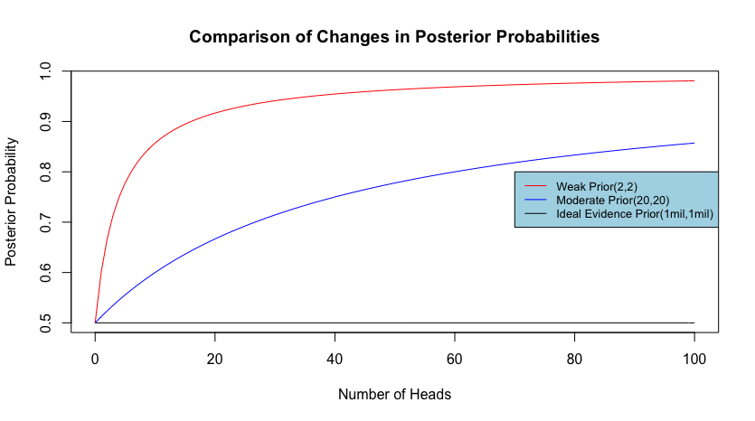
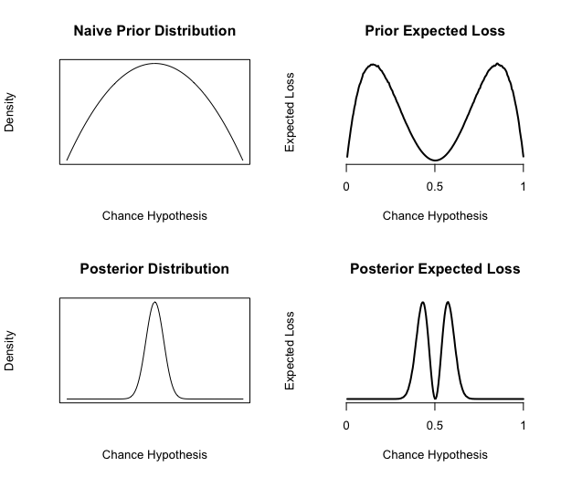
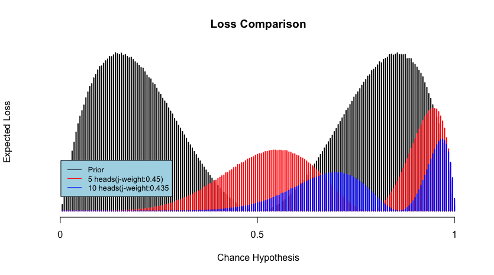

## Weight of Evidence
<!--
In this chapter I shall examine accounts of evidential weight by Keynes and others. I will examine four views in total: Keynes' early view of weight as the absolute amount of evidence, Ramsey's weight as the expected value of information, the resiliency account in formal epistemology, and, lastly, Keynes's refined view expressed in his *General Theory of Employment, Interest, and Money*. These views, with the exception of the last one aims to capture our intuition about the weight of evidence by explicating the notion in terms of some formal notions, such as conditional relevance or expected utility. While they can be, and often are, seen as competing accounts for evidential weight, my claim is that there is a conceptual unity in these views, and that they are quantitative measures that capture important aspects of the very notion of evidential weight.

This chapter is divided in four major sections, each devoted to an account of weight. In the first section, I shall focus on Keynes' original proposal that evidential weight is the absolute amount of relevance evidence, and I shall show that Keynes' attempt to tie weight directly to relevance backfires. In section 2, I will try to extrapolate an account of evidential weight from a note by Ramsey, written in response to a puzzle about weight posed by Keynes. In section 3, I focus on the notion of resiliency mentioned by Jeffrey, formalized by Skyrms, and recently refined by Joyce. In the last section, I return to Keynes, by trying to reconstruct a different notion of weight by interpreting Keynes' disagreement with G. E. Moore on the force of expected value, in light of his later ideas about the role of Knightian uncertainty plays in economics.
 -->

<!--
My main purpose is to argue against Keynes' idea that the weight of evidence for a belief is the absolute amount of relevant evidence we have for that belief. Keynes defines _relevance_ in terms of the difference between prior and posterior probabilities - an account still accepted by many Bayesians. Nevertheless, he notices that sometimes intuitively relevant evidence could change the probability of the hypothesis in question through conditionalization. He then proposes a "strict" definition to capture those cases. As we shall see, the second definition has the problematic implication of regarding any proposition $P$ not implied by another proposition $H$ and our background knowledge as being relevant to $H$. After examining and criticizing his notion of evidential weight as the amount of relevant evidence, I turn to an important remark by Keynes that, I shall suggest, opens the door to the core epistemological problem the very idea of evidential weight is supposed to address. I call this the problem of epistemic urgency. -->

<!-- # Weight as Absolute Amount of Evidence -->

Keynes' exposition of the weight of evidence in his _Treatise on Probability_ is perhaps the most referenced source in the topic. While he seems rather ambivalent about the importance of evidential weight, saying that he finds it "somewhat novel" but is "uncertain as to how much importance to attach to it," he has made many important contributions to ways in which evidential weight can be conceptualized. The reason for Keynes' hesitation lies in the difficulty in formally capturing this rather intuitive idea. To begin, the weight of evidence begins with the observation that the numeric value of a probability does not preserve the amount of evidence on which it is based on. For instance, suppose two agents $A$ and $B$ are trying to determine the proportion of black balls in some urn. If $A$ randomly sampled from the urn twice and found 1 black ball and $B$ found 50 balls out of 100 samples, it would seem that both of their evidence suggests that the probability of drawing a black ball from the urn is $0.5$, assuming they both would like to base their probability judgment purely on their respective evidence, but it would seem that some important information is lost in the process. 

The second section of the chapter examines Keynes' classic suggestion that the evidential weight for a probability judgment is measured as the  _absolute amount_ of relevance evidence. The third section analyzes with the so-called paradox of the ideal evidence by Popper. Even though the argument Popper tries to make with the so-called paradox relies on questionable premises, it serves as an useful introduction to the more sophisticated proposal to capture the weight of evidence. Some basic formal notions are  introduced in forth section to provide the necessary background. The section that follows is a presentation of Skyrms' notion of resiliency, which takes the weight of evidence to be the change in conditional probability in light of a surprising hypothesis, and James Joyce's idea that evidential weight is a stabilizer of expected loss. This chapter then ends with analysis of these notions of weight by using various statistical models as illustration, accompanied by relevant visualization. While this chapter partly functions as a review on the literature on the weight of evidence, its main contribution is to present the formal account of evidential weight in a conceptually and historically unified manner, in service of the philosophical discussion in the upcoming chapters.

<!-- # Historical Background: Why is the Weight of Evidence Important? -->
<!-- 
## Peirce's Role 

While the idea of evidential weight is closely associated with Keynes’ discussion in *A Treatise*, Carnap [554] and Popper point out that Peirce was really the first person who gave a substantial treatment of the issue. Nevertheless, discussions of Peirce’s notion of weight are often 

There are three possible reasons for which the importance of Peirce’s view on the matter has gone relatively unnoticed. One of the reasons is that Peirce’s explicit discussion of evidential weight is embedded in his criticisms of subjective interpretation of probability, known as “conceptualism”, in his time. Like Keynes, Peirce recognizes that there is a sense of confidence that is not captured by degrees of belief, and Peirce argues that this is a fatal flaw of conceptualism. Since evidential weight only seems to occur in a critical context, it perhaps gives the impression that Peirce lacks a positive view on the matter. 

The other reason is terminological. Peirce uses both the terms ‘balance’ and ‘weight’ to describe evidence, but from the context it is clear that in both cases he’s referring to idea that probability can act as an indicator of whether a belief is favored or disfavored by the overall evidence - what Keynes calls the balance of the evidence. Peirce in fact never gives a name to what Keynes, and what came to be known in the literature as, the weight of evidence.  He simply refers to it as the number that is required to properly express our doxastic state, in addition to the degree of a belief.

Lastly, Peirce’s own mathematical expression of the balance of evidence adopted by various Bayesians, which further overshadows his notion of weight. Roughly speaking, Peirce’s idea is that to find the balance of the evidence $E$ for the proposition $H$, we should take the odds of the probability of $H$ conditional on $E$ versus its probability conditional on $\neg E$. In other words,
$$\frac{P(H|E)}{P(\neg H | E)}$$ Which can be algebraically decomposed into $$\frac{P(E|H)P(H)}{P(E|\neg H) P(\neg H)}$$
Using Principle of Indifference, which will be discussed below, the above becomes $\frac{H}{\neg H} = 1$, the balance of evidence is simply $\frac{P(E|H)}{P(E| \neg H)}$, which is an expression of what we now call the Bayes Factor. Peirce's intention was to construct what he takes to be the best version of conceptualism before knocking it down. The Bayes Factor is attractive for many reasons. From a modern and practical standpoint, this formula is mathematically tractable, since we do not have to calculate the posterior distribution $p(H|E)$ and the so-called Bayesian catchall $P(E)$, both of which can be computationally expensive. From a philosophical point of view, Peirce thought that the Bayes Factor forges the link between conceptualist's subjective view of probability, and Hume's empiricist epistemology. In *An Enquiry Concerning Human Understanding*, Hume makes his famous argument against the existence of miracle by appealing to the concept of probability. Hume argues that due to the fact that the only evidence we have regarding miracle is witness testimony, whether or not miracle exists can only be determined probabilistically by determining the balance of the evidence: 

> We balance the opposite circumstances, which cause any doubt or uncertainty; and when we discover a superiority on any side, we incline to it; but still with a diminution of assurance, in proportion to the force of its antagonist.[@enquiry 99]

> Take the sum of all the feelings of belief which would be produced separately by all the arguments pro, subtract from that the similar sum for arguments con, and the remainder is the feeling of belief which we ought to have on the whole.[@probabilityofinduction,  294]

For example, given a prior odd of 1 for $A$ and evidence $E$, the posterior odd for $A$, $\frac{P(A|E)}{P(\neg A |E)}$ can be reformulated as the likelihood ratio: $\frac{P(E|A)}{P( E| \neg A)}$. After taking the log of the ratio as Peirce suggested, we can find the balance of reasons by calculation $log(P(E|A)) - log(P(E|\neg A))$. A positive value means the evidence is in favor of A and negative against it. 

Another important normative implication is the idea that the strengths of two independent pieces of evidence should be combinable to increase the probability of the proposition in question. Peirce calls this the weight of evidence, but, as explained in the next paragraph, it is better described as the added weight of independent evidence. Suppose $E_1$ and $E_2$ are independent. So, $P(E_1 \wedge E_2 |H) = P(E_1|H) P(E_2|H)$. If we take the logarithm of the product, the product becomes $log(P(E_1|H))+ log(P(E_2|H))$.  This captures the intuition that adding two pieces of independent evidence together should increase the intensity of our belief. 

Branden Fitelson takes Peirce’s idea of taking the logarithm of posterior odds and develops a Bayesian account of independent evidence.[@Fitelson2001-FITABA] 

The water is further muddled by the fact that I. J. Good, who refers to Peirce as a precursor to his own Bayesian view, confusingly calls this formula the weight of the evidence, which, while consistent with Peirce’s use of the term, is not the Keynesian sense that come to be the standard. [@joycehpre, 165] 

### The Concept of Weight in “Probability of Induction”.
Peirce’s illustration of weight is roughly as follows:  imagine two urns $A$ and $B$ with unknown proportions of black and white balls. Suppose you sample (with replacement) 100 balls from the urn $A$ and find 50 black balls and 50 white balls. Justifiably, you infer that the proportion of black balls in $A$ - call it $\theta_A$ is about $0.5$. You then decide to sample from $B$, but this time you only manage to draw 4 samples, 3 of which are black balls. Your best estimate for $\theta_B$ is $0.75$. At this point, I offer you another chance to draw from one of the urns, and if you manage to draw a black ball from that urn, you get $100. Which urn would you pick?

Clearly, $\theta_B > \theta_A$, but it is not clear that $B$ is obviously the better choice, because the amount of evidence you have for $\theta_A = 0.5$ is higher than for $\theta_B = 0.75$. This is a problem for probabilism, because, in terms of just comparing the probabilities alone, picking urn $B$ clearly has a higher probability of winning; however, all the facts in the situation are different than what the probability lets on, so the probabilistic approach overlooks some crucial information.

Peirce suggests that the conceptualist account of degrees of belief cannot be right here. To belabor the implication a bit, further consider another urn $C$, from which you draw 2 balls, and one of them is white, so your best estimate would be $\theta_c = 0.5$. If degrees of belief are just probabilities, then it must mean that your doxastic attitude toward $A$ and $B$ ought to be the same, but Peirce insists that this cannot be the case. 

> In short, to express the proper state of our belief, not one number but two are requisite, the first depending on the inferred probability, the second on the amount of knowledge on which that probability is based. 

This is because, while the probability of getting a black ball given a ball is drawn from $A$ is the same of the same probability conditional on drawing from $B$, i.e., $0.5$, the respective weight for them cannot be the same. This must mean, then, there is an 

 -->

However, just because abduction is ultimately guessing does not mean that it involves nothing but luck. An important idea is that the beginning of abduction usually involves a leap of faith, but this leap can be made *strategically*.  Peirce explains the strategic nature of abduction with an analogy of the game of "twenty questions", in which one party has to think of an object, while another party has to find out what the object by asking 20 or less questions.[@essentialpeirce2 109] Peirce's idea is that posing a question in the game is akin to proposing a hypothesis in an inquiry---for both cases, we make a guess about the nature of the subject of our inquiry, and the difference is that in the game the answer we receive is certain and direct, while a hypothesis has to be tested or broken down into sub-hypothesis. Peirce has an important point in mind, however, with this example. That is, the choice of a question can drastically alter the course of an inquiry. Since the question of the game has to figure out what the answer is by asking at most 20 questions, she ask them strategically. Each question the inquire asks should be as informative as possible---they should, for instance, ask questions that narrow the space of possibilities as quickly as possible. Abduction, which is the logic of hypothesis selection, is guided by a similar goal.

Hintikka suggests that looking at the role played by strategic thinking in deductive thinking is helpful in understanding what Peirce has in mind. Hintikka points out that even though there is an emphasis on mechanical rules of inference, deductive thinking involves more than that. Suppose a student is asked, in an exam for a logic class, to demonstrate that $$\vdash [[A\to(B\wedge \neg C)] \wedge (\neg B \vee D) ]\to (A\to D)$$ In other words, to prove that it is a logical truth. Before proving that, she must make a decision on which method to use. Since she is pressed for time, she must choose to prove this strategically. For instance, suppose she choose the strategy of trying to show that it is always true. one way would be to use the truth table to show that the proposition is true in all possible interpretations. But that would be a inefficient choice, since there will be $2^4=16$ rows and she cannot skip any row since she's trying to prove a logical truth. Alternatively, she could prove it using natural deduction, which calls more further strategic thinking: an often recommended strategy for proving logical truth is by *Reductio ad Absurdum*, that is, by showing a contradiction from the negation of the said logical truth. But in this case, this would hardly seem like a good decision, since she would end up with a long negated conditional. A better strategy would be to prove the result conditionally assuming the antecedent of the conditional. Depending on the rules available to her, such a method would take 10 or less lines. So, a successful deductive reasoner must know all the basic rules of inferences, but she must also master policies or strategies that are more suggestive in nature. 

The important point here is that the strategic dimension of reasoning often finding a way to gain as much information as possible in light of some constraint. In the game of twenty questions, the constraint is that the questioner only gets 20 questions. For the student taking a logic exam, she is bound by the time she has. In both cases, the reasoner has to make a decision on confronting the problem she faces in an efficient manner. In particular, before even tackling the problem they are interested, both reasoners must select one of many methods in which the problem could be addressed. Often, the efficacy of the chosen method cannot be determined until it has been actually tried, so there will be always be an element of guessing involved. 

The strategic dimension of abduction, as Peirce sees it, pertains to how our resources is allocated in service to our epistemological goal, and this is addressed by a branch of abductive reasoning called *the economy of research*: 

> Proposals for hypotheses inundate us in an overwhelming flood, while the process of verification to which each one must be subjected before it can count as at all an item, even of likely knowledge, is so very costly in time, energy, and money---and consequently in ideas which might have been had for that time, energy, and money, that Economy would override every other consideration even if there were any other serious considerations. In fact there are no others.[@CP 5.602]

The creative and suggestive nature of abductive inference makes it permissive in nature, and, for it to be reliable, it must be guided by economical considerations that discriminate between productive and unproductive proposals. According to the schema Peirce provides, we can infer that there is a reason to suspect a hypothesis to be true, as long as it accounts for the facts somehow. To be sure, Peirce makes it clear that the permissive nature of abduction must be tempered by the pragmatic maxim---a hypothesis must be distinguishable by their experimental and practical consequences.[@essentialpeirce2 234] Still, for many facts, there could be countless possible testable accounts, and examining every single possible abductive suggestion is not only imprudent, but it impedes greatly our ability to find the right hypothesis.[@CP 2.776] 

Peirce's view on abduction provides a crucial insight on James and van Fraassen's voluntarism. James can be interpreted to be arguing for the rationality of the belief in God on the same ground: it is a hypothesis that is full of abductive virtues: it is a hypothesis that, if true, would have tremendous informational value, and would radically improve the agent's life.  

## Weight as the Absolute Amount of Evidence

### Keynes on Relevance and Weight

In any case, more pertinent to the notion of evidential weight is the _judgment of irrelevance_ and *relevance*. Keynes' observation is that we often can judge whether one proposition $E$ counts as being relevant to another proposition $H$ by considering whether the probability of $H$ would change on the supposition that $E$ is true. Keynes's example is that, in a typical urn example with some black and white balls, if we want to know the probability of a white ball being randomly chosen, the _color_ of the ball would not change its probability of being chosen, so the idea is that a ball's probability of being chosen conditional on being (say) white is the same as the probability of the ball being chosen in general. [@keynes, 59] So, Keynes proposes that evidence $E$ is irrelevant to the proposition $H$ if and only if:

$$P(H|E ) \neq P(H) $$

Now that the notion of relevance has been introduced, we come to Keynes' idea of the weight of evidence. Keynes is troubled by the fact that the degree of a probability does not scale straightforwardly with the amount of the evidence we have at hand. In a well-known passage, Keynes says:

> As the relevant evidence at our disposal increases, the magnitude of the probability of the argument may either decrease or increase, according as the new knowledge strengthens the unfavourable or the favourable evidence; but something seems to have increased in either case,—we have a more substantial basis upon which to rest our conclusion. I express this by saying that an accession of new evidence increases the weight of an argument. New evidence will sometimes decrease the probability of an argument, but it will always increase its ‘weight.’

The crucial idea here is the weight of evidence is closely tied to the _absolute amount_ of evidence and is conceptual distinct from the "magnitude" of a probability. Keynes explains this as the distinction between the *balance* and the *weight* of evidence: he first brings our attention to the fact that when we consider the conditional probability of the hypothesis in question under all relevant evidence, the resultant number constitutes the _balance_ between favorable and unfavorable evidence.[@keynes, 78] For instance, we may say that when the conditional probability $P(H|E) > 0.5$, then evidence $E$ is somewhat in favor of the hypothesis. Of course, the balance changes as we gather more relevant evidence, and it might go from favorable from unfavorable depending on the nature of the new evidence.

However, as Keynes points out, this is not the only epistemologically significant relation between probability and evidence, for we not only care about how much the current evidence favors the hypothesis, but we also concern ourselves with the _amount_ of evidence involved in calculating the balance of the evidence, and Keynes calls this measure the _weight_ of evidence. But, unlike the balance of the evidence, which can go either direction, the weight of evidence can only go up as we gather more relevant evidence. In Keynes' words, "New evidence will sometimes decrease the probability of an argument, but it will always increase its 'weight.'"[@keynes, 78]

Keynes gives two examples in which the comparison of evidential weight can be determined. The first is that probabilities based on an application of the Principle of Indifference always have the same weights. The second is that two arguments with the same conclusion, but if one is conditional on more relevant evidence, then it is more weighty. For example, say the conclusion is $C$, and we have relevant evidence $A$ and $B$. The weight of the evidence for $P(C|(A\wedge B))$ is greater than $P(C|A)$ as long as 

$$P(C|(A\wedge B)) \neq P(C|A)$$ 

That is, as long as $B$ is relevant evidence to $C$.

A critical assumption Keynes makes in the just mentioned quote is that evidential weight forms a correlative relationship with the amount of _relevant_ evidence: bringing in new evidence _always_ increases the weight of the evidence. As a matter of fact, Keynes suggests that as a matter of definition, to introduce new relevant evidence is simply another way to say that the weight of evidence has increased. [@keynes, 78-9] The implication of this is that since relevance here is defined in terms of the difference between prior and posterior probabilities, the increase in the weight of evidence must be accompanied by a change in probability.

However, this also contradicts directly with Keynes' earlier observation that sometimes can change the weight of the evidence but not its balance. Keynes is aware of this tension, and tries to resolve it by introducing a "strict" definition of relevance.

### The Strict Definition of Relevance

The problem, as Keynes sees it, is that sometimes complex evidence $E$ might be irrelevant to $H$, but its logically simpler components $E_1$ and $E_2$ could be relevant to $H$, so what we have a situation in which some evidence, when gathered altogether, is irrelevant to the hypothesis in question, but, were they gathered separately, they would yield a posterior probability different than the prior, and so they are would individually relevant.

What Keynes has in mind seems to be this: suppose, by a justified judgment of indifference, you have reasons to believe that the urn in front of you contains $50\%$ white balls and $50\%$ black balls, so your probability for $H$, drawing a black ball, would be $0.5$. Further suppose $E_x$ says 'a ball with the color $x$ is randomly drawn and replaced', where $x = w$ for white and $x=b$ for black.

Now further suppose that we have received evidence $E$, where $E = E_b \wedge E_w$. At this point, an argument could be made that your degree of belief for $H$ should stay at $0.5$, since the sample mean is exactly that. In fact, this is a situation in which the use of Laplace's "rule of succession" is justified. ^['...Thus one finds that when an event has happened any number of times running, the probability that it will happen again next time is equal to this number increased by 1, divided by the same number increased by 2.'[@laplace, 11]]. According to this rule, $P(H|E_b \wedge E_w)$ is

$$\frac{1+1}{2+1+1} = \frac{2}{4}=\frac{1}{2}$$

But suppose $E_b$ and $E_w$ are not gathered at the same time: say $E_b$ was received first---this would sensibly nudge your opinion slightly toward the opinion that the proportion of black balls is higher than $50\%$. This could be verified by the rule of succession: $P(H|E_b) = \frac{2}{3} \neq P(H)$, so $E_b$ is relevant to $H$. *Mutatis mutandis*, the same argument could be made for $E_w$. So we have a situation where getting $E_w$ and $E_b$ together does not increase the weight of the evidence, but getting them sequentially would lead to an increase. Though he, too, has to speculate Keynes’ precise meaning, Carnap gives a similar but formal example.[@carnapprob, p.419]

To avoid this type of problems, Keynes proposes a 'strict' definition of irrelevance. While Keynes calls this the 'strict' definition, the purpose of the definition is to relax the requirement for relevance, so that evidence that is irrelevant "as a whole" may still be relevant due to its components. The strict definition states:

> \textbf{Definition of Relevance}: $E$ is relevant to $H$ on background knowledge $K$ if and only if there is at least one proposition $R$, such that

>1.  $R$ is inferable from $(E \wedge K)$.
>2.  $R$ is not inferable from $K$.
>3.  $P(H | R \wedge K )\neq P(H|K)$
>4.  If there is _no_ proposition that satisfies conditions 1-3, then $E$ is irrelevant to $H$.

In other words, the strict definition tries to capture the idea that a piece of evidence $E$ is relevant $H$ if and only if $R$, in conjunction with your existing body of knowledge, can imply some proposition $R$ that is conditionally relevant to $H$. So in the case where $E = E_b \wedge E_w$, $E$ is *not* irrelevant, i.e., relevant, to $H$, because $E_b$, which is inferable from $E \wedge K$, does raise the probability $H$. So, with this new definition, Keynes tries to maintain the close connection between the weight of evidence and the absolute amount of evidence.

Unfortunately, this definition does too little and too much at the same time. It does too little, because not all weighty but irrelevant evidence can be easily decomposed in the way Keynes describes. This is the point of Popper's "paradox of ideal evidence." We shall discuss this in more detail in a later section, but the basic idea is that sometimes the evidence we receive is in the form of a basic statistical summary, such as "in a million tosses of the coin $c$, heads occurs in $500,000 \pm 20$ cases."[@popperlogic, 425] So, assuming our prior for the probability of $c$ landing on heads is $1/2$, being conditional on the basic statistical summary should not change this probability---both the prior and posterior probabilities should be $1/2$.

There is something suspicious about this argument, but there does seem to be some difficulty in analyzing the statistical summary in the way Keynes recommends. It might work if the statistical report is a chain of conjunctions, that is, $E_1 \wedge ... E_i ... \wedge E_{1m}$ where the subscript be the index of the trial. _If_ we were to interpret it this way, we might be able to infer $E_1$, which, for example, says that the coin lands on heads on the first toss, and conditional on $E_1$ we get a different posterior probability. But this is not what this report is saying, for we do not know exactly in which of the tosses the coin lands on heads and which tosses tails. In fact, modeled as a Bernoulli trial, the idea is that this particular order does not matter in drawing inferences. Further, it is clear we need more than a chain of conjunctions, because we are given an interval. It is possible that with some clever maneuver we could interpret the statistical report as a chain of disjunctions of conjunctions, but at this point, we must ask ourselves if we are analyzing the evidence or if we are simply distorting it.

There has been attempts to modify Keynes' definition of relevance slightly to accommodate Popper's paradox.[@odonnell, p.50-51] Roughly speaking, the proposal draws from Keynes' stipulation that if $X$ to $Y$ is relevant, then $\neg X$ is also relevant, and the solution would require adding another condition for relevance that requires both conditional probabilities of $P(Y|X)$ and $P(Y|\neg X)$ to be different than $P(Y)$.

As it turns out, however, this point is inconsequential, because Carnap has proven that these additional conditions that supposedly saves Keynes' account of relevance from Popper's paradox renders the relevance relation trivial. Hence I said Keynes' definition also does too much: Keynes' strict definition has the consequence of regarding almost any proposition as being relevant to another, as long as one is not a logical entailment of the another.

### The Problematic Implication of the Strict Definition

Carnap's argument is that Keynes's strict definition has essentially counted anything not implied by background knowledge as being relevant, because any proposition that is not implied by our background knowledge plus hypothesis will always have implied components that are relevant to $H$, however weakly.[@carnapprob, p.420] The argument is roughly that, for any $H$ on background knowledge $K$, if $J$ is not implied by $(H \wedge K)$ and $R$ is some arbitrary evidence relevant to $H$, $J$ can always be shown to be relevant by drawing trivial inferences that that involves $R$, such as $(J \vee \neg R)$.

For a formal argument, first consider these two assumptions about relevance.

> R1. If $E$ is relevant, then $\neg E$ is also relevant.

> R2. If a hypothesis is not implied by our background knowledge, then there is some proposition such that it is relevant to the hypothesis.

I will not argue for these assumptions, but note that they are explicitly accepted by Keynes, so we do not have to find them plausible; we just have to accept them for the sake of this particular argument. In addition, Carnap has also proven that Keynes' definition of irrelevance is equivalent to the following:

> \textbf{Carnap's Definition of Irrelevance}: $E$ is irrelevant to $H$ on $K$ if and only if

>1.  $P(H|K) = P(H|K\wedge E)$ _or_,
>2.  $E\wedge K$ is a contradiction.

This alternative definition will be useful in the proof. Carnap's proof is roughly as follows.^[@carnapprob p.420. My presentation also partly follows @garden] Suppose both evidence $J$ and hypothesis $H$ are contingent on, i.e., not inferable from,  background knowledge $K$. Also suppose a different piece of evidence $R$ that is relevant to $H$ on $K$ - $R$ must exist because of assumption R2 above. For an argument by cases, let $E$ be $(R \wedge \neg J)$. $E$ is either relevant or irrelevant to $H$, and from this we can make an argument by cases. It will be demonstrated that from these assumptions alone, we already know $J$ is relevant, whether or not $E$ is relevant.

Suppose $E$ is relevant: this means that $E$ is relevant to $H$ by virtue of Keynes' stricter definition; because, $E$ contains $R$, which is relevant to $H$ on $K$. By assumption R1, since $E$ is relevant to $H$, $\neg E$ is also relevant to $H$. But this means $J$ is relevant to $H$ as well: $\neg E$ is equivalent to $(\neg R \vee J)$, which is inferable from $J$. Since an implication of $J$ is relevant to $H$ given $K$, this means $J$ must be relevant to $H$.

Now suppose $E$ is irrelevant. Since $R$ is relevant to $H$ on $K$, the only way for $E$ to be irrelevant is for $(\neg J \wedge K \wedge R)$ to be a contradiction (by Carnap's alternative definition), so $\neg(\neg J \wedge K \wedge R)$ has to be true. That is logically equivalent to $(\neg J \wedge K) \to \neg R$. Now, by assumption R1, $\neg R$ is relevant, because $R$ is relevant. The above formula means that from $\neg J$ plus $K$, we can infer $\neg R$, so this means $\neg J$ is relevant, which entails $J$ is relevant.

So, we see that both each case implies that $J$ is relevant. By argument by cases, then, $J$ is relevant. Thus, if $J$ is not inferable from $K$, then $J$ is relevant to $H$.

In addition, if $J$ is relevant to $H$ on $K$, then $J$ is not inferable from $K$, since one of the conditions of the strict definition of relevance is that relevant evidence cannot be a proposition that is a logical consequence of our background knowledge. So, this means that $J$ is relevant to $H$ on $K$ if and only if $J$ is not inferable from $K$.

Loosely speaking, this means that for two propositions, they can be shown to be relevant to each other as long as they do not imply, or contradict each other. Carnap's result shows that Keynes' strict definition is not useful: Carnap thinks that we should simply stick with the simpler definition of relevance. Modern Bayesian have followed Carnap in accepting Keynes' basic definition of relevance as a minimal requirement for any confirmation measure. 

The conclusion to be drawn, I think, is that evidential weight clearly has something to do with how much evidence we have, but it is not worth the trouble to *define* the weight of evidence as the absolute amount of evidence. 

The supposed link between relevance and weight is especially difficulty if probability is to be conceived as a *logical* relation. A deductive analogue of evidential weight would be the number of premises needed to derive the conclusion. In deductive logic, there are different ways in which the same conclusion could be derived; however, in a deductive proof, it makes absolutely no difference between a 2 line proof and 10 line proof. In other words Logic is *weight agnostic*. From a *logical* point of view, we do not care how many premises are involved as long as the argument is valid. Insofar as the number of premises is significant, it is for extralogical reasons. A shorter proof might be desirable because of its elegance, and a longer proof might be less desirable because it's more prone to have false premises. These are, however, not logical consideration, but more general epistemological ones. Thus, it makes no sense to draw a conceptual connection between evidential weight, a non-logical notion, and relevance, a notion that tracks degree of logical entailment.

<!-- Further, That the notion of evidential weight goes beyond just the absolute amount of evidence is something Keynes himself recognizes. Keynes sometimes refers the weight of evidence a balance "between the absolute amounts of relevant knowledge and of relevant ignorance respectively"[@keynes, p. 78] In a later chapter of the *Treatise*, he also calls weight "the degree of completeness of the information"[@keynes, p.357] These remarks suggest that weight is about how we *do not* know as much as how much we *do* know. The relationship between ignorance and weight will be examined in the next section. -->

<!-- 
This, I think, is one of the normative roles played the weight of evidence: it ought to provide a way to justify the stability of certain judgments. It should guide us in distinguishing between a mature state of belief and just plain stubbornness. The latter is often irrational, and an agent who is simply refusing evidence out of stubbornness should be considered as irrational. -->

<!-- # Chance, Resilience, and the Probability of Probability -->

<!-- This will be elaborated in this section by appealing to the notion *resiliency* in formal epistemology, which has been proposed by Skyrms and Joyce as a explication of evidential weight.
 -->
<!-- In the previous sections, we saw that the amount and utility of evidence are part of how we think of the weight of evidence, and stability is one way in which the dynamic between the two is summarized. This complements Keynes' idea that when the evidence is weighty, additional data appears to be less desirable, in that it should also be noted that the high weight is not necessarily *only* a function of the amount of relevance we have; because, sometimes the low desirability of more evidence could be caused by the low expected utility, instead of the lack of evidence. -->
<!-- 
The idea that evidential weight is a sort of stability allows us to see it not merely as a measurement, but a *disposition*: what *would* happen to my belief, if I were to get new evidence that supports or undermine my current belief? This is implicit in talking about weight as a stability, for stability *is* a disposition.
 -->

<!--
The basic idea here is that evidential weight cannot be Skyrm's idea of conditional resiliency, because what is being stabilized here is not -->

 

<!-- Skyrms has not spelled this out for the ideal paradox case, but it is easy to demonstrate the difference in resiliency using basic statistical tools. For comparison, assume in the "some evidence" scenario we have tossed the coin 40 times in the past and exactly half of the landed of heads. For the "ideal evidence" scenario, it is the same exactly the coin was tossed one million times. We would expect that the weight of evidence would be higher for the ideal evidence scenario and the belief that the coin is fair ought to be fair resilient. This is clearly seen from figure 1. 

In the figure, X represents the new and extreme evidence: a series of $x$ heads out of $x$ tosses. What the plot aims to shows is how one's state of belief responds to evidence given some body of evidence. 

 -->

<!-- We can see that if we already had the ideal evidence, our belief that the coin is fair would be quite resistant to new evidence: even if we were to flip 100 consecutive heads, the probability would barely raise. In the case of no prior evidence, the situation is quite different: starting with no evidence, would jump to after 5 flips, and rapidly approach certainty after 20 flips. Even with just some evidence, the belief would already exhibits some degree of resilience---it climbs steadily as the number of heads increases, in a rate much slower than the one with no evidence at all. So here we seem to have a response to Popper's paradox: even though that the expected value for these initial distributions are all at $0.5$, they _respond_ to new evidence differently.

The plot also provides an illustration of Jeffrey's point about learning. Suppose, instead of treating these data scenarios as the posteriors, we can instead suppose them to different choices of priors. Imagine that I approach the problem with an ideal-evidence like state of belief---I will learn next to nothing even if I see 100 heads in a row. On the other hand, with a no-evidence state of mind, my opinion will be swayed rather quickly. This provides a framework to answer the question posed in section two regarding the rationality of refusing evidence. One argument could be made on the ground that if my state of belief is such that no foreseeable amount of evidence could change the degree of this belief, I am rational in refusing it as long as there is some cost involved---if I already have the ideal evidence, it definitely is not even worth my *time* to toss the coin for 100 times, because I know that it would have made no difference even if I got 100 heads consecutively. -->

<!-- Of course, there is nothing intrinsically irrational about each of these assumptions. For certain beliefs, there are reasons for them to be entrenched, but the problem is that it is unclear how this could be determined just by looking at resiliency. On what ground could we adjudicate a sufficiently mature judgment and a groundless prejudice? -->

While resiliency seems to be a workable as an intuitive answer for Popper's paradox, many important questions still need to be answered: what exactly is being stabilized? Stabilized by what? Let's not forget that evidence rarely comes packaged perfectly as the ideal evidence does. It is relatively intuitive to think that a statistical report of half a million heads out of a million stabilizes the belief that the coin is fair, but we almost never have ideal evidence. Often the evidence we get do not say exactly which belief it's supposed to stabilize. If I toss the coin once and it turns up head, my evidence is such that heads is the result of one out of one toss, but that does not mean it is stabilizing my belief that the coin is biased to land only on heads.

<!-- More important, how does the resilience of a belief affect one's decision? Recall that Keynes' difficulty with evidential weight is that it seems like it could override the mandate of the expected value. It is not at all clear how resiliency is supposed help with that: when push comes to shove, all three priors have the same expected value, and therefore would recommend the same course of action. -->

James Joyce has recently proposed that what evidential weight does is to stabilize the distance between one's subjective probability of an event and her underlying hypotheses of the objective chance about it. Joyce's proposal requires a bit of setup. The distinction between degrees of belief and propensity from subsection 2 is highly relevant here. In addition, I prefer to conceptualize the same idea in terms of *Bayesian risk* and *loss* instead of *distance*. Not only do I think it is more intuitive that way, it also more in line the literature on Bayesian statistical decision theory. 

<!-- With the distinction between chance and probability in mind, let us return to the question of what exactly resiliency is, and how evidential weight figures in this. It seems that resiliency is what we have when a probability is stable, but it's not yet clear what that means. -->

<!-- To begin, we have to clarify *which* probability is being stabilized by the evidence. For the ideal evidence case, the stabilizing agent is the statistical report given to us - this much is clear. Now, One suggestion seems to be that what's being stabilized is $P(X_{n+1}=1)$, that is, the probability that the next toss coming up heads. However, as our analysis of the paradox of the ideal evidence shows, this is not the right way to think about it - our degree of belief for $X_{n+1}=1$, when modeled, is conditional on our degrees of belief in the objective propensity of the coin. My subjective probability for $X_{n+1}=1$
 -->
It is helpful to motivate the idea of Bayesian risk intuitively. Consider the following example: we would like to guess the proportion of black balls, $\theta$, in an urn, and we know that $\theta$ is either $0.1$, $0.5$, or $0.9$. Let $X_i$ be the result of the $i$th draw, and $X_i = 1$ if the ball is black and $0$ otherwise. Recall that, we started by assigning the same subjective probability to the three hypothesis, and based on these assumption our initial subjective probability for drawing a ball $P(X=1) = 0.5$. We then drew one sample from the urn, and found one black ball, and then we update our beliefs as follows:

$$P(\theta = 0.9|X_1) = 0.6$$
$$P(\theta = 0.5|X_1) = 0.333$$
$$P(\theta = 0.1|X_1) = 0.067$$
$$P(X_2=1|X_1=1)=0.7132$$

This is the same result as before, but it is helpful to reason through the calculation intuitively: the hypothesis that renders our evidence likely should be considered as being supported by the evidence. Clearly, if $\theta=0.9$, it is natural that we get a black ball, so the balance of the current evidence should suggest that this hypothesis is the most favored by the evidence, following by $\theta=0.5$. Also, since I now regard hypotheses that favor higher proportion of black balls as being more credible, naturally my all things considered expectation is that the next draw is probably another black ball, in a way that mirrors my degree of belief for $\theta = 0.9$, which $0.6$, as being higher than $\theta = 0.5$, which is $0.333$. This is reflected by $P(X_2=1|X_1=1)=0.7132$, which is closer to $0.9$ than $0.5$. If we *have* to act now and choose a hypothesis, clearly $\theta = 0.9$ is the best option we have. Let's call this action $a= 0.9$. 

In section 2, we stipulated that we will get \$1 for guessing the correct hypothesis and nothing otherwise. Now suppose the rules are different: we do not win anything; however, we lose nothing if we guess correctly, and if we make a wrong guess, our loss is proportional to how far our guess is from the actual state of affair. For instance, given $a$, we should lose more if the proportion turns out to be 0.1 than 0.5. There are different _loss functions_ with which this loss could be calculated; a popular choice is the so-called the squared loss function: $(\theta - a)^2$.^[This is Joyce's recommendation as well, even though he does not justify it. I take the choice of the loss function to be a context-dependent pragmatic choice, so I see no reason to think *a priori* that one loss function is better than another.] If it turns out that $\theta = 0.5$, then our loss would be $(0.5-0.9)^2 = 0.16$. Intuitively, we can think of the squared loss as a way to formalize "how wrong we are" in terms the distance between our action and how things really are. The idea of the expected loss is to account for the probability of each potential loss. We know that there are only three possible proportions, so

1.  There is a probability of 0.6 that $\theta = 0.9$: we lose nothing.
2.  There is a probability of 0.333 that $\theta = 0.5$: we lose 0.16.
3.  There is a probability of 0.067 that $\theta = 0.1$:  we lose 0.64.

We can see that our decision was a good one, since we are most probably not going to lose anything. It also makes sense that we would lose the most if it turns out that $\theta = 0.1$. The individual expected loss for each possible state of affair for $a$ is respectively $0, 0.053, .043$, and the _Bayesian risk_ is the sum of these values, which is $.096$. Following the statistical decision theory literature, we will use $L(\theta,a)$ to refer to loss incurred by action $a$, given the state of the world is $\theta$, and $E(L(\theta,a))$ to refer to the overall expected loss.

Joyce's claim is that the "basic" resilient quantity is $L(x,a)P(\theta=x)$, which is what was referred to as "individual expected loss" above. Formally, it is the possible loss discounted by its probability of occurrence. It is helpful to compare the prior and posterior distributions to see why this quantity is a good candidate. First, consider the following table that summarizes the difference between the two distributions:

|Hypothesis| Prior Probability| Posterior Probability   |    Difference      |
| :------------- | --------------------:  | --------------------: |-------------------: |
| $\theta = 0.9$   |                $0.333$ |$0.6$ |$0.27$| 
| $\theta = 0.5$|                   $0.333$ |$0.333$ | 0  | 
| $\theta = 0.1$|                   $0.333$ |$0.067$ |$0.27$ |

The table makes it relatively obvious what the evidence is doing to our belief. It rewards the hypothesis that favors a high chance of black balls while punishing the rest in proportional to how wrong they are. Hence Joyce says:

> The real effect of the weight of evidence is to ensure that such increases in the disparity between chance and credence are compensated by proportional decreases in the probabilities of the offending chance hypotheses.[@joycehpre, p.166]

Speaking somewhat metaphorically, while $\theta = 0.5$ cannot be rewarded by the evidence, it cannot be punished either---since it does suggest that we have a $50\%$ chance of drawing a black ball. Hence it is untouched. This captures the important intuition that the bigger the gamble the higher reward---the extreme hypotheses will be punished severely by contrary evidence, but they are also handsomely rewarded. While a middle of the road cannot be easily punished, it will not be easily reward either.

However, as Joyce argues, the changes in probabilities is not a good indicator of resilience. Judging from the probability table alone, it would appear that $\theta = 0.5$ is a resilient hypothesis. This is misleading---consider the losses summarized by the table below:

|Hypothesis| Prior Loss($a=0.5$)| Posterior Loss ($a=0.9$)  |    Difference      |
| :------------- | --------------------:  | --------------------: |-------------------: |
| $\theta = 0.9$   |                $0.16$ |$0$ |$0.16$| 
| $\theta = 0.5$|                   $0$ |$0.16$ | $0.16$  | 
| $\theta = 0.1$|                   $0.16$ |$0.64$ |$0.48$ |

The first table by itself is a misleading representation of the situation, because it seems to suggest that our belief about $\theta = 0.5$ is stable, but its resilience cannot be considered in separation of my attitude about the rest of the hypotheses. In particular, the evidence has greatly changed my state of belief: I no longer think that all three hypotheses are equally probable. Now I clearly think that $\theta = 0.9$ is the most credible hypothesis. This piece of information is missing from considering the changes in prior and posterior probabilities alone, since they do not account for my shift from thinking choosing $a = 0.5$ to $a = 0.9$. This is however reflected by the loss function. 

## An Analysis of the Two Concepts of Resiliency

Joyce's suggested measurement of weight is, roughly speaking, the sum of difference between prior and posterior expected loss. Assuming the distribution is discrete, let $X$ be the marginal probability of the next outcome, $E$ be the evidence, and $\theta$ be the objective chance of interest:

$$\text{Joycean Weight}:\sum_x |p(\theta = x|E)(x-p(X|E))^2 - p(\theta = x)(x-p(X))^2|$$

Now recall Skyrms prefers to measure weight directly in terms of the difference between prior and posterior probabilities. 

$$\text{Skyrmsian Weight Resiliency of }(P(X)=y): 1 - |P(X|E_j) - y|$$

Where $j$ is in the set of $n$ possible states of affairs, $E_1,..., E_n$. Skyrms' idea is that we should pick a $j$ that creates the biggest difference. 

Note that Joycean weight measures neither the weight of evidence nor resiliency directly; rather, it is a measure of instability, so the the lower the Joycean weight, the weighter the evidence is. Skyrms' measure is the opposite - it is intended to be a direct representation of resiliency.

We should ground our thinking in an example, so that our discussion will not get carried away by formalism. Consider a Popperian scenario in which we have to distinguish a somewhat naive state of belief and one after receiving strong evidence that the the coin is fair. Compare two distributions: a prior distribution with a very slight inclination toward $\theta=0.5$ and the posterior after receiving the statistical report that the coin has been flipped 100 times with exactly 50 of them landing on heads. 

For a more overarching comparison of the two definitions of weight, consider Figure 1. The two plots summarizes the Joycean and Skyrmsian weights of the two distributions in light of a sequence of extreme evidence, that is, a series of consecutive heads being tossed. 

Skyrms' resilience is represented on the right---the resilience of the posterior distribution is easily expressed, as we see that the resilience of the belief that the coin is fair, i.e., $\theta = 0.5$, never dips below $0.8$, even after witnessing 50 heads in a row. The prior, in red, loses its resilience rapidly. Its resilience against seeing 20 tosses of heads is at around $0.6$. Note that the resilience for $\theta = 0.5$ cannot drop below $0.5$.

### Skyrmsian Weight

To understand Skyrms' proposal, it might help to see the interaction between the evidence and posterior probability directly---this is shown in the figure 2. As before, the x-axis represents the number of heads in a row, so the higher x is, the more extreme the evidence we have. The y-axis is the posterior probability after receiving the x heads out of x throws as indicated by the x-axis.

 

We can see that if we already had the ideal evidence, our belief that the coin is fair would be quite resistant to new evidence: even if we were to flip 100 consecutive heads, the probability would barely raise. In the case of no prior evidence, the situation is quite different: starting with no evidence, would jump to after 5 flips, and rapidly approach certainty after 20 flips. Even with just some evidence, the belief would already exhibits some degree of resilience---it climbs steadily as the number of heads increases, in a rate much slower than the one with no evidence at all---even though the expected value for these initial distributions are all at $0.5$, they _respond_ to new evidence differently.

This plot also provides an illustration of Jeffrey's point about learning. Imagine that I approach the problem with an ideal-evidence like state of belief---I will learn next to nothing even if I see 100 heads in a row. On the other hand, with a weak prior, my opinion will be swayed rather quickly. This provides a framework to answer the question regarding the rationality of refusing evidence. One argument could be made on the ground that if my state of belief is such that no foreseeable amount of evidence could change the degree of this belief, I am rational in refusing it, since it will not be very information *to me*, assuming there is some sort of cost. If I already have the ideal evidence, it definitely is not even worth my *time* to toss the coin for 100 times, because I know that it would have made no difference even if I got 100 heads consecutively. 

Skyrms' notion faces an important difficulty, however. As a matter of definition, we can compute the resilience of a belief about chance only by against the background of some surprising scenario, which is supposed to be taken from a set of possible scenarios. Originally, Skyrms is using the concept of resiliency to explicate the concept of the laws of nature, so in his context, it makes sense to have this set to be relatively unrestricted---the set of scenarios in which the laws of physics are applicable, for instance, ought to be very expansive. 

But in a more general context, what should be considered as part of set of the possible states of affairs can be contentious. Should I consider the degree of the belief that the coin is fair, for example, conditional on the outlandish assumption that the coin is being telekinetically controlled? My belief will not be resilient against such a scenario, but it is not clear if I should consider it a realistic possibility. The ambiguity of the space of possibilities turns out to be an important issue, which is to be examined in chapter 2. To anticipate, the difficulty lies in the fact that the resiliency of my beliefs depend on the potential evidence that *I* can think of, but a very real possibility in the future could be beyond my grasp now for some reason. Suppose you asked me for the resilience of my partial belief in the eventuality of World War 3 in 2013. When probing the stability of this belief, I would not have found it relevant to consider this belief conditional on the possible evidence that the President of the United States was a reality television personality. This would not have been a live option, until the election in 2017. Thus, it would appear that the notion of resilience is not something we can determine within the inductive framework, and it relies on pragmatic assumptions made prior the logical space is delineated.

### Joycean Weight

How do we make sense out of Joyce's proposal? It is useful to look at the shapes of the distributions and how they affect the expected loss. Figure 2 represents these distributions and their respective expected losses visually. The modes for both distributions are both at $0.5$, following Popper's requirement that both states ought to assign the the probability of next toss turning up heads as being $0.5$. The plots representing the expected losses provides a useful illustration on how the basic quantity of resilience is a balance between its distance from the expected value (the mode) and the probability of an objective chance hypothesis. Joycean weight is essentially the sum of the difference between the top right plot and the top bottom plot. 

Interesting, Joycean weight is not always increasing, i.e., non-monotonic. This appears to be a direct consequence of the conceptual fact that hypothesis far away from the mode receives discounted penalty since it would have a low probability. To get an intuitive view, compare the loss distributions plotted in Figure 3. The red distribution represents the posterior loss after receiving 5 heads in a row, which is a local maximum and the blue represents the posterior loss after receiving 10 heads in a row, which is a local minimum. Since a lower Joycean weight is supposed to represent a higher weight of evidence, this actually means that the prior distribution is more resilient against having 10 heads in a row than 5. The plot suggests that after 10 heads, $\theta = 0.5$ becomes so improbable that its loss started to become heavily discounted, resulted a similar loss expected by the prior distribution. On the other hand, after 5 heads, $\theta = 0.5$ happens to become where we expect heavy loss, hence yielding a higher difference from the prior distribution.

Joyce's definition is more computationally expensive compared to Skyrms, and arguably less intuitive. It is also less applicable, because it requires not only the use of a loss function, but also a precise prior distribution. Joyce recognizes this, and suggests that his proposal can at best capture a special case in which the weight of evidence can be clearly captured.

# Conclusion

We have seen that evidential weight manifests itself in a number of different ways---the amount of evidence, difference in conditional probabilities, and resiliency of expected loss. The main goal of this chapter is to present these ideas in the most intuitive way possible, in the facilitation of the philosophical substance in the next chapters. In particular, perhaps the most pressing issue---one that has been absence from the discussion of the weight of evidence after Keynes---is the *normative* role it is supposed to play. It is easy to get lost between the formalism and metaphors, but it is important not to lose sight of what is at stake here: evidential weight, if it were to be a substantive concept, must answer questions that the balance of the evidence does not. As a matter of fact, Keynes finds this far more puzzling than the quantitative measurement of the weight of evidence. This is the issue to which we shall now turn in chapter 2.